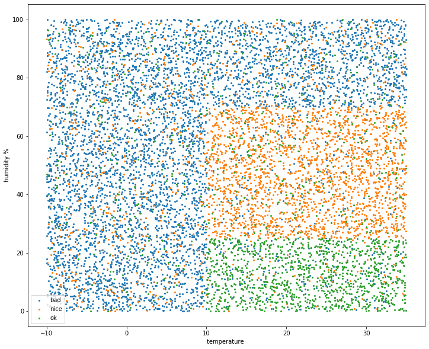
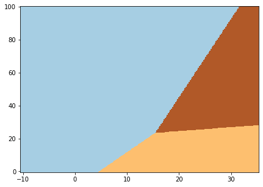
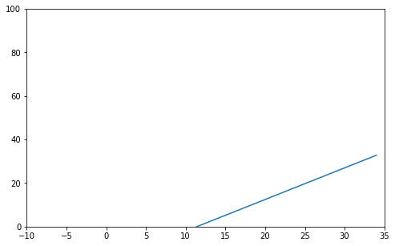
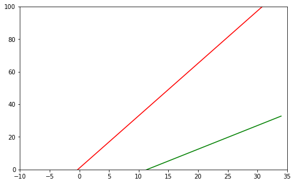

# WORK IN PROGRESS
Just a messy notebook I used to generate some synthetic data and labels, to build a simple ML model and get coefficients for decision boundaries, used later in my Rust code on STM32F1 with BME280 environment sensor.


```python
import pandas as pd
```


```python
import random
```


```python
n = 10000
```


```python
# generate random values in range from -10 to 35 for temperature and 0 to 100 for humidity

data = pd.DataFrame({'temp': [random.random() * 45 - 10 for _ in range(n)], 
                     'hum': [random.random() * 100 for _ in range(n)]})
```


```python
# check if generated values look OK

data.describe()
```


<div>
<style scoped>
    .dataframe tbody tr th:only-of-type {
        vertical-align: middle;
    }

    .dataframe tbody tr th {
        vertical-align: top;
    }

    .dataframe thead th {
        text-align: right;
    }
</style>
<table border="1" class="dataframe">
  <thead>
    <tr style="text-align: right;">
      <th></th>
      <th>temp</th>
      <th>hum</th>
    </tr>
  </thead>
  <tbody>
    <tr>
      <th>count</th>
      <td>10000.000000</td>
      <td>10000.000000</td>
    </tr>
    <tr>
      <th>mean</th>
      <td>12.492388</td>
      <td>49.817336</td>
    </tr>
    <tr>
      <th>std</th>
      <td>13.052862</td>
      <td>28.783640</td>
    </tr>
    <tr>
      <th>min</th>
      <td>-9.993413</td>
      <td>0.004202</td>
    </tr>
    <tr>
      <th>25%</th>
      <td>1.052624</td>
      <td>25.152596</td>
    </tr>
    <tr>
      <th>50%</th>
      <td>12.520486</td>
      <td>49.894043</td>
    </tr>
    <tr>
      <th>75%</th>
      <td>23.819750</td>
      <td>74.581331</td>
    </tr>
    <tr>
      <th>max</th>
      <td>34.994183</td>
      <td>99.999582</td>
    </tr>
  </tbody>
</table>
</div>


```python

```


```python
# humidity below 25% is considered 'dry', above 70%: 'humid', otherwise it's moderate

data.loc[data['hum'] < 25, 'hum_cat'] = 'dry'
data.loc[data['hum'] > 70, 'hum_cat'] = 'humid'
data.loc[data['hum_cat'].isna(), 'hum_cat'] = 'moderate'

```


```python
data.head()
```


<div>
<style scoped>
    .dataframe tbody tr th:only-of-type {
        vertical-align: middle;
    }

    .dataframe tbody tr th {
        vertical-align: top;
    }

    .dataframe thead th {
        text-align: right;
    }
</style>
<table border="1" class="dataframe">
  <thead>
    <tr style="text-align: right;">
      <th></th>
      <th>temp</th>
      <th>hum</th>
      <th>hum_cat</th>
    </tr>
  </thead>
  <tbody>
    <tr>
      <th>0</th>
      <td>-9.895657</td>
      <td>94.587835</td>
      <td>humid</td>
    </tr>
    <tr>
      <th>1</th>
      <td>19.882215</td>
      <td>65.536729</td>
      <td>moderate</td>
    </tr>
    <tr>
      <th>2</th>
      <td>10.956352</td>
      <td>90.759686</td>
      <td>humid</td>
    </tr>
    <tr>
      <th>3</th>
      <td>3.653477</td>
      <td>40.023353</td>
      <td>moderate</td>
    </tr>
    <tr>
      <th>4</th>
      <td>16.621728</td>
      <td>18.904795</td>
      <td>dry</td>
    </tr>
  </tbody>
</table>
</div>


```python
# temperature below 10°C is considered 'cold', above 22°C: 'warm', otherwise it's moderate
```


```python
data.loc[data['temp'] < 10, 'temp_cat'] = 'cold'
data.loc[data['temp'] > 22, 'temp_cat'] = 'warm'
data.loc[data['temp_cat'].isna(), 'temp_cat'] = 'moderate'
```


```python
data.head()
```


<div>
<style scoped>
    .dataframe tbody tr th:only-of-type {
        vertical-align: middle;
    }

    .dataframe tbody tr th {
        vertical-align: top;
    }

    .dataframe thead th {
        text-align: right;
    }
</style>
<table border="1" class="dataframe">
  <thead>
    <tr style="text-align: right;">
      <th></th>
      <th>temp</th>
      <th>hum</th>
      <th>hum_cat</th>
      <th>temp_cat</th>
    </tr>
  </thead>
  <tbody>
    <tr>
      <th>0</th>
      <td>-9.895657</td>
      <td>94.587835</td>
      <td>humid</td>
      <td>cold</td>
    </tr>
    <tr>
      <th>1</th>
      <td>19.882215</td>
      <td>65.536729</td>
      <td>moderate</td>
      <td>moderate</td>
    </tr>
    <tr>
      <th>2</th>
      <td>10.956352</td>
      <td>90.759686</td>
      <td>humid</td>
      <td>moderate</td>
    </tr>
    <tr>
      <th>3</th>
      <td>3.653477</td>
      <td>40.023353</td>
      <td>moderate</td>
      <td>cold</td>
    </tr>
    <tr>
      <th>4</th>
      <td>16.621728</td>
      <td>18.904795</td>
      <td>dry</td>
      <td>moderate</td>
    </tr>
  </tbody>
</table>
</div>


```python
# combine the two columns
data['weather'] = data['temp_cat'] + ' ' + data['hum_cat']
```


```python
data.head()
```


<div>
<style scoped>
    .dataframe tbody tr th:only-of-type {
        vertical-align: middle;
    }

    .dataframe tbody tr th {
        vertical-align: top;
    }

    .dataframe thead th {
        text-align: right;
    }
</style>
<table border="1" class="dataframe">
  <thead>
    <tr style="text-align: right;">
      <th></th>
      <th>temp</th>
      <th>hum</th>
      <th>hum_cat</th>
      <th>temp_cat</th>
      <th>weather</th>
    </tr>
  </thead>
  <tbody>
    <tr>
      <th>0</th>
      <td>-9.895657</td>
      <td>94.587835</td>
      <td>humid</td>
      <td>cold</td>
      <td>cold humid</td>
    </tr>
    <tr>
      <th>1</th>
      <td>19.882215</td>
      <td>65.536729</td>
      <td>moderate</td>
      <td>moderate</td>
      <td>moderate moderate</td>
    </tr>
    <tr>
      <th>2</th>
      <td>10.956352</td>
      <td>90.759686</td>
      <td>humid</td>
      <td>moderate</td>
      <td>moderate humid</td>
    </tr>
    <tr>
      <th>3</th>
      <td>3.653477</td>
      <td>40.023353</td>
      <td>moderate</td>
      <td>cold</td>
      <td>cold moderate</td>
    </tr>
    <tr>
      <th>4</th>
      <td>16.621728</td>
      <td>18.904795</td>
      <td>dry</td>
      <td>moderate</td>
      <td>moderate dry</td>
    </tr>
  </tbody>
</table>
</div>


```python
data['weather'].unique()
```


    array(['cold humid', 'moderate moderate', 'moderate humid',
           'cold moderate', 'moderate dry', 'warm humid', 'cold dry',
           'warm dry', 'warm moderate'], dtype=object)


```python
# weather is classified as one of three classes: 'nice', 'average', 'bad'
```


```python
weathercats = ['nice', 'ok', 'bad']
```


```python
# randomize

random_cats = {}

for idx, cat in enumerate(weathercats):
    output = [weathercats[idx] for _ in range(17)] + [weathercats[idx-1] for _ in range(2)] + [weathercats[idx-2]]
    random_cats[cat] = output

    

```


```python
def randomizer(row, cat):
    return random.choice(random_cats[cat])
```


```python
data.head()
```


<div>
<style scoped>
    .dataframe tbody tr th:only-of-type {
        vertical-align: middle;
    }

    .dataframe tbody tr th {
        vertical-align: top;
    }

    .dataframe thead th {
        text-align: right;
    }
</style>
<table border="1" class="dataframe">
  <thead>
    <tr style="text-align: right;">
      <th></th>
      <th>temp</th>
      <th>hum</th>
      <th>hum_cat</th>
      <th>temp_cat</th>
      <th>weather</th>
    </tr>
  </thead>
  <tbody>
    <tr>
      <th>0</th>
      <td>-9.895657</td>
      <td>94.587835</td>
      <td>humid</td>
      <td>cold</td>
      <td>cold humid</td>
    </tr>
    <tr>
      <th>1</th>
      <td>19.882215</td>
      <td>65.536729</td>
      <td>moderate</td>
      <td>moderate</td>
      <td>moderate moderate</td>
    </tr>
    <tr>
      <th>2</th>
      <td>10.956352</td>
      <td>90.759686</td>
      <td>humid</td>
      <td>moderate</td>
      <td>moderate humid</td>
    </tr>
    <tr>
      <th>3</th>
      <td>3.653477</td>
      <td>40.023353</td>
      <td>moderate</td>
      <td>cold</td>
      <td>cold moderate</td>
    </tr>
    <tr>
      <th>4</th>
      <td>16.621728</td>
      <td>18.904795</td>
      <td>dry</td>
      <td>moderate</td>
      <td>moderate dry</td>
    </tr>
  </tbody>
</table>
</div>


```python
data['weather_cat'] = ''
```


```python
data.head()
```


<div>
<style scoped>
    .dataframe tbody tr th:only-of-type {
        vertical-align: middle;
    }

    .dataframe tbody tr th {
        vertical-align: top;
    }

    .dataframe thead th {
        text-align: right;
    }
</style>
<table border="1" class="dataframe">
  <thead>
    <tr style="text-align: right;">
      <th></th>
      <th>temp</th>
      <th>hum</th>
      <th>hum_cat</th>
      <th>temp_cat</th>
      <th>weather</th>
      <th>weathercat</th>
      <th>weather_cat</th>
    </tr>
  </thead>
  <tbody>
    <tr>
      <th>0</th>
      <td>-9.895657</td>
      <td>94.587835</td>
      <td>humid</td>
      <td>cold</td>
      <td>cold humid</td>
      <td></td>
      <td></td>
    </tr>
    <tr>
      <th>1</th>
      <td>19.882215</td>
      <td>65.536729</td>
      <td>moderate</td>
      <td>moderate</td>
      <td>moderate moderate</td>
      <td></td>
      <td></td>
    </tr>
    <tr>
      <th>2</th>
      <td>10.956352</td>
      <td>90.759686</td>
      <td>humid</td>
      <td>moderate</td>
      <td>moderate humid</td>
      <td></td>
      <td></td>
    </tr>
    <tr>
      <th>3</th>
      <td>3.653477</td>
      <td>40.023353</td>
      <td>moderate</td>
      <td>cold</td>
      <td>cold moderate</td>
      <td></td>
      <td></td>
    </tr>
    <tr>
      <th>4</th>
      <td>16.621728</td>
      <td>18.904795</td>
      <td>dry</td>
      <td>moderate</td>
      <td>moderate dry</td>
      <td></td>
      <td></td>
    </tr>
  </tbody>
</table>
</div>


```python
# weather is considered 'nice' if it's either warm and dry, or moderate temperature and dry 
data.loc[data['weather'].isin(['warm dry', 'moderate dry']), 'weather_cat'] \
= data.loc[data['weather'].isin(['warm dry', 'moderate dry']), 'weather_cat'].apply(lambda row: randomizer(row,'nice'))
```


```python
# weather is considered 'bad' when it's cold and/od humid
data.loc[data['weather'].isin(['cold humid', 'moderate humid', 'cold moderate', 'warm humid', 'cold dry']), 'weather_cat'] \
= data.loc[data['weather'].isin(['cold humid', 'moderate humid', 'cold moderate', 'warm humid', 'cold dry']), 'weather_cat'] \
.apply(lambda row: randomizer(row, 'bad'))
```


```python
# if it's some other combination, then the weather is considered 'ok'
data.loc[data['weather'].isin(['warm moderate','moderate moderate']), 'weather_cat'] \
= data.loc[data['weather'].isin(['warm moderate','moderate moderate']), 'weather_cat'] \
.apply(lambda row: randomizer(row, 'ok'))
```


```python

```


```python
data.head()
```


<div>
<style scoped>
    .dataframe tbody tr th:only-of-type {
        vertical-align: middle;
    }

    .dataframe tbody tr th {
        vertical-align: top;
    }

    .dataframe thead th {
        text-align: right;
    }
</style>
<table border="1" class="dataframe">
  <thead>
    <tr style="text-align: right;">
      <th></th>
      <th>temp</th>
      <th>hum</th>
      <th>hum_cat</th>
      <th>temp_cat</th>
      <th>weather</th>
      <th>weathercat</th>
      <th>weather_cat</th>
    </tr>
  </thead>
  <tbody>
    <tr>
      <th>0</th>
      <td>-9.895657</td>
      <td>94.587835</td>
      <td>humid</td>
      <td>cold</td>
      <td>cold humid</td>
      <td></td>
      <td>bad</td>
    </tr>
    <tr>
      <th>1</th>
      <td>19.882215</td>
      <td>65.536729</td>
      <td>moderate</td>
      <td>moderate</td>
      <td>moderate moderate</td>
      <td></td>
      <td>ok</td>
    </tr>
    <tr>
      <th>2</th>
      <td>10.956352</td>
      <td>90.759686</td>
      <td>humid</td>
      <td>moderate</td>
      <td>moderate humid</td>
      <td></td>
      <td>bad</td>
    </tr>
    <tr>
      <th>3</th>
      <td>3.653477</td>
      <td>40.023353</td>
      <td>moderate</td>
      <td>cold</td>
      <td>cold moderate</td>
      <td></td>
      <td>bad</td>
    </tr>
    <tr>
      <th>4</th>
      <td>16.621728</td>
      <td>18.904795</td>
      <td>dry</td>
      <td>moderate</td>
      <td>moderate dry</td>
      <td></td>
      <td>nice</td>
    </tr>
  </tbody>
</table>
</div>


```python
import matplotlib.pyplot as plt
```


```python
# plot all the data points

fig, ax = plt.subplots(figsize = (12,10))
for cat in data['weather_cat'].unique():
    plt.scatter(x = data.loc[data['weather_cat'] == cat, 'temp'], y = data.loc[data['weather_cat'] == cat, 'hum'], s = 4)
ax.set_ylabel('humidity %')
ax.set_xlabel('temperature ')
ax.legend(['bad', 'nice', 'ok'])
```


    <matplotlib.legend.Legend at 0x7fde692170d0>





```python
data['weather_cat'] = pd.Categorical(data['weather_cat'])
```


```python
data['weather_cat_idx'] = data['weather_cat'].cat.codes
```


```python
# bad is 0, nice is 1, ok is 2

data.head()
```


<div>
<style scoped>
    .dataframe tbody tr th:only-of-type {
        vertical-align: middle;
    }

    .dataframe tbody tr th {
        vertical-align: top;
    }

    .dataframe thead th {
        text-align: right;
    }
</style>
<table border="1" class="dataframe">
  <thead>
    <tr style="text-align: right;">
      <th></th>
      <th>temp</th>
      <th>hum</th>
      <th>hum_cat</th>
      <th>temp_cat</th>
      <th>weather</th>
      <th>weathercat</th>
      <th>weather_cat</th>
      <th>weather_cat_idx</th>
    </tr>
  </thead>
  <tbody>
    <tr>
      <th>0</th>
      <td>-9.895657</td>
      <td>94.587835</td>
      <td>humid</td>
      <td>cold</td>
      <td>cold humid</td>
      <td></td>
      <td>bad</td>
      <td>0</td>
    </tr>
    <tr>
      <th>1</th>
      <td>19.882215</td>
      <td>65.536729</td>
      <td>moderate</td>
      <td>moderate</td>
      <td>moderate moderate</td>
      <td></td>
      <td>ok</td>
      <td>2</td>
    </tr>
    <tr>
      <th>2</th>
      <td>10.956352</td>
      <td>90.759686</td>
      <td>humid</td>
      <td>moderate</td>
      <td>moderate humid</td>
      <td></td>
      <td>bad</td>
      <td>0</td>
    </tr>
    <tr>
      <th>3</th>
      <td>3.653477</td>
      <td>40.023353</td>
      <td>moderate</td>
      <td>cold</td>
      <td>cold moderate</td>
      <td></td>
      <td>bad</td>
      <td>0</td>
    </tr>
    <tr>
      <th>4</th>
      <td>16.621728</td>
      <td>18.904795</td>
      <td>dry</td>
      <td>moderate</td>
      <td>moderate dry</td>
      <td></td>
      <td>nice</td>
      <td>1</td>
    </tr>
  </tbody>
</table>
</div>


```python
from sklearn.linear_model import LogisticRegression
```


```python
X = data[['temp', 'hum']]
```


```python
y = data['weather_cat_idx']
```


```python
logreg = LogisticRegression(C = 1e5)
```


```python
logreg.fit(X,y)
```


    LogisticRegression(C=100000.0, class_weight=None, dual=False,
                       fit_intercept=True, intercept_scaling=1, l1_ratio=None,
                       max_iter=100, multi_class='warn', n_jobs=None, penalty='l2',
                       random_state=None, solver='warn', tol=0.0001, verbose=0,
                       warm_start=False)


```python
logreg.coef_
```


    array([[-0.09970853,  0.0309918 ],
           [ 0.06826359, -0.04702842],
           [ 0.05767628, -0.00212381]])


```python
logreg.intercept_
```


    array([-0.02518554, -0.77952247, -1.6711203 ])


```python
x_min, x_max = X.iloc[:,0].min() - .5, X.iloc[:,0].max() + .5, 
```


```python
y_min, y_max = X.iloc[:,1].min() - .5, X.iloc[:,1].max() + .5, 
```


```python
h = .2 # step in the mesh
```


```python
import numpy as np
```


```python
xx, yy = np.meshgrid(np.arange(x_min, x_max, h), np.arange(y_min, y_max, h))
```


```python
Z = logreg.predict(np.c_[xx.ravel(), yy.ravel()])
```


```python
Z = Z.reshape(xx.shape)
```


```python
plt.figure(1, figsize = (7,5))
plt.pcolormesh(xx, yy, Z, cmap = plt.cm.Paired)
```


    <matplotlib.collections.QuadMesh at 0x7fde54c26350>





```python
data.info()
```

    <class 'pandas.core.frame.DataFrame'>
    RangeIndex: 10000 entries, 0 to 9999
    Data columns (total 8 columns):
     #   Column           Non-Null Count  Dtype   
    ---  ------           --------------  -----   
     0   temp             10000 non-null  float64 
     1   hum              10000 non-null  float64 
     2   hum_cat          10000 non-null  object  
     3   temp_cat         10000 non-null  object  
     4   weather          10000 non-null  object  
     5   weathercat       10000 non-null  object  
     6   weather_cat      10000 non-null  category
     7   weather_cat_idx  10000 non-null  int8    
    dtypes: category(1), float64(2), int8(1), object(4)
    memory usage: 488.5+ KB


```python
data['weather_cat'].unique()
```


    [bad, ok, nice]
    Categories (3, object): [bad, ok, nice]


```python
# get the two boundaries for 'nice' and for 'bad'
```


```python
data.loc[data['weather_cat'] == 'nice', 'nice'] = 1
```


```python
data.loc[data['nice'].isna(), 'nice'] = 0 
```


```python

```


```python
data.loc[data['weather_cat'] == 'bad', 'bad'] = 1
```


```python
data.loc[data['bad'].isna(), 'bad'] = 0 
```


```python
data.head()
```


<div>
<style scoped>
    .dataframe tbody tr th:only-of-type {
        vertical-align: middle;
    }

    .dataframe tbody tr th {
        vertical-align: top;
    }

    .dataframe thead th {
        text-align: right;
    }
</style>
<table border="1" class="dataframe">
  <thead>
    <tr style="text-align: right;">
      <th></th>
      <th>temp</th>
      <th>hum</th>
      <th>hum_cat</th>
      <th>temp_cat</th>
      <th>weather</th>
      <th>weathercat</th>
      <th>weather_cat</th>
      <th>weather_cat_idx</th>
      <th>nice</th>
      <th>bad</th>
    </tr>
  </thead>
  <tbody>
    <tr>
      <th>0</th>
      <td>-9.895657</td>
      <td>94.587835</td>
      <td>humid</td>
      <td>cold</td>
      <td>cold humid</td>
      <td></td>
      <td>bad</td>
      <td>0</td>
      <td>0.0</td>
      <td>1.0</td>
    </tr>
    <tr>
      <th>1</th>
      <td>19.882215</td>
      <td>65.536729</td>
      <td>moderate</td>
      <td>moderate</td>
      <td>moderate moderate</td>
      <td></td>
      <td>ok</td>
      <td>2</td>
      <td>0.0</td>
      <td>0.0</td>
    </tr>
    <tr>
      <th>2</th>
      <td>10.956352</td>
      <td>90.759686</td>
      <td>humid</td>
      <td>moderate</td>
      <td>moderate humid</td>
      <td></td>
      <td>bad</td>
      <td>0</td>
      <td>0.0</td>
      <td>1.0</td>
    </tr>
    <tr>
      <th>3</th>
      <td>3.653477</td>
      <td>40.023353</td>
      <td>moderate</td>
      <td>cold</td>
      <td>cold moderate</td>
      <td></td>
      <td>bad</td>
      <td>0</td>
      <td>0.0</td>
      <td>1.0</td>
    </tr>
    <tr>
      <th>4</th>
      <td>16.621728</td>
      <td>18.904795</td>
      <td>dry</td>
      <td>moderate</td>
      <td>moderate dry</td>
      <td></td>
      <td>nice</td>
      <td>1</td>
      <td>1.0</td>
      <td>0.0</td>
    </tr>
  </tbody>
</table>
</div>


```python
# logistic regression for 'nice' vs. everything else
```


```python
X = data[['temp', 'hum']] 

```


```python
y = data['nice']
```


```python
logreg.fit(X,y)
```


    LogisticRegression(C=100000.0, class_weight=None, dual=False,
                       fit_intercept=True, intercept_scaling=1, l1_ratio=None,
                       max_iter=100, multi_class='warn', n_jobs=None, penalty='l2',
                       random_state=None, solver='warn', tol=0.0001, verbose=0,
                       warm_start=False)


```python
W_nice, b_nice = logreg.coef_, logreg.intercept_
```


```python
W_nice

```


    array([[ 0.06826359, -0.04702842]])


```python
b_nice
```


    array([-0.77952247])


```python
x = np.arange(-10,35)
```


```python
y = -(x * W_nice[0][0] + b_nice[0]) / W_nice[0][1]
```


```python
fig, ax = plt.subplots(figsize = (8,5))
ax.set_xlim(-10,35)
ax.set_ylim(0,100)
plt.plot(x, y)
```


    [<matplotlib.lines.Line2D at 0x7fde54be6d90>]





```python

```


```python
X = data[['temp', 'hum']] 

```


```python
y = data['bad']
```


```python
logreg.fit(X,y)
```


    LogisticRegression(C=100000.0, class_weight=None, dual=False,
                       fit_intercept=True, intercept_scaling=1, l1_ratio=None,
                       max_iter=100, multi_class='warn', n_jobs=None, penalty='l2',
                       random_state=None, solver='warn', tol=0.0001, verbose=0,
                       warm_start=False)


```python
W_bad, b_bad = logreg.coef_, logreg.intercept_
```


```python
W_bad

```


    array([[-0.09970853,  0.0309918 ]])


```python
b_bad
```


    array([-0.02518554])


```python
t = np.arange(-10,35)
```


```python
h_nice = -(t * W_nice[0][0] + b_nice[0]) / W_nice[0][1]
```


```python
h_bad = -(t * W_bad[0][0] + b_bad[0]) / W_bad[0][1]
```


```python
fig, ax = plt.subplots(figsize = (8,5))
ax.set_xlim(-10,35)
ax.set_ylim(0,100)
plt.plot(t, h_nice, c = 'g')
plt.plot(t, h_bad, c = 'r')

```


    [<matplotlib.lines.Line2D at 0x7fde547952d0>]





```python
samples = [(25,70), (10,15), (24,23), (21,60), (7,60), (23,15), (28,80)]
```


```python

```


```python
for sample in samples:
    t, h = sample
    
    h_nice = -(t * W_nice[0][0] + b_nice[0]) / W_nice[0][1]
    h_bad = -(t * W_bad[0][0] + b_bad[0]) / W_bad[0][1]
    
    print("temp {}°C, hum {}% - hum_nice {}%, hum_bad {}%".format(t,h,h_nice, h_bad))
    
    if h >= h_bad:
        print("temp: {}°C, hum: {}% - bad! :(".format(t,h))
    elif h <= h_nice:
        print("temp: {}°C, hum: {}% - nice! :) ".format(t,h))
    else:
        print("temp: {}°C, hum: {}% - it's ok.".format(t,h))
    
```

    temp 25°C, hum 70% - hum_nice 19.71291557867815%, hum_bad 81.24403029375354%
    temp: 25°C, hum: 70% - it's ok.
    temp 10°C, hum 15% - hum_nice -2.060170511303494%, hum_bad 32.985203098168974%
    temp: 10°C, hum: 15% - it's ok.
    temp 24°C, hum 23% - hum_nice 18.261376506012706%, hum_bad 78.02677514738124%
    temp: 24°C, hum: 23% - it's ok.
    temp 21°C, hum 60% - hum_nice 13.906759288016376%, hum_bad 68.37500970826433%
    temp: 21°C, hum: 60% - it's ok.
    temp 7°C, hum 60% - hum_nice -6.414787729299824%, hum_bad 23.333437659052063%
    temp: 7°C, hum: 60% - bad! :(
    temp 23°C, hum 15% - hum_nice 16.809837433347266%, hum_bad 74.80952000100895%
    temp: 23°C, hum: 15% - nice! :) 
    temp 28°C, hum 80% - hum_nice 24.06753279667448%, hum_bad 90.89579573287047%
    temp: 28°C, hum: 80% - it's ok.


```python

```


```python
from sklearn.preprocessing import PolynomialFeatures
```


```python
from sklearn.pipeline import Pipeline
```


```python
from sklearn.model_selection import train_test_split

```


```python
X = data[['hum', 'temp']]
```


```python
y = data['weather_cat_idx']
```


```python
poly = PolynomialFeatures(degree = 2, interaction_only = False, include_bias = False)
```


```python
X_train, X_test, y_train, y_test = train_test_split(X,y)
```


```python
X_train.shape
```


    (7500, 2)


```python
X_poly = poly.fit_transform(X_train)
```


```python
X_poly.shape
```


    (7500, 5)


```python
lr = LogisticRegression()
```


```python
lr.fit(X_poly, y_train)
```


    LogisticRegression(C=1.0, class_weight=None, dual=False, fit_intercept=True,
                       intercept_scaling=1, l1_ratio=None, max_iter=100,
                       multi_class='warn', n_jobs=None, penalty='l2',
                       random_state=None, solver='warn', tol=0.0001, verbose=0,
                       warm_start=False)


```python
lr.score(poly.transform(X_test), y_test)
```


    0.812


```python
lr.coef_
```


    array([[-0.05867425, -0.22381246,  0.00064098,  0.00203191,  0.00057312],
           [-0.11351455,  0.17867957,  0.00097417, -0.00152636, -0.00197617],
           [ 0.16371461,  0.09708219, -0.00176706,  0.00037869, -0.00162209]])


```python
lr.intercept_
```


    array([ 2.31396237, -0.29475986, -4.66592429])


```python

```


```python
'''
Once the model is fit we call .coef_ and .intercept_ to see the predicted coefficients and intercept term. 
Following the linear form Y = Mx + b we can now see the linear equation for our decision boundary is 
Sepal_Length * (0.4437) + Petal_Width * (-4.6018) + 0.9626. 

so that's SL * W[0] + PW * W[1] + b

SL is X, PW is Y

so PW * W[1] = -SL * W[0] - b
therefore PW = -(SL*W[0] + b) / W[1]
'''


```


```python

```


```python

```


```python
X = data[['hum', 'temp']]
```


```python
y = data['nice']
```


```python
poly = PolynomialFeatures(degree = 2, interaction_only = False, include_bias = False)
```


```python
X_train, X_test, y_train, y_test = train_test_split(X,y)
```


```python
X_train.shape
```


    (7500, 2)


```python
X_poly = poly.fit_transform(X_train)
```


```python
X_poly.shape
```


    (7500, 5)


```python
lr = LogisticRegression()
```


```python
lr.fit(X_poly, y_train)
```


    LogisticRegression(C=1.0, class_weight=None, dual=False, fit_intercept=True,
                       intercept_scaling=1, l1_ratio=None, max_iter=100,
                       multi_class='warn', n_jobs=None, penalty='l2',
                       random_state=None, solver='warn', tol=0.0001, verbose=0,
                       warm_start=False)


```python
lr.score(poly.transform(X_test), y_test)
```


    0.8984


```python
W = lr.coef_
```


```python
W
```


    array([[-0.08605272,  0.19827515,  0.00075882, -0.00193614, -0.00202101]])


```python
b = lr.intercept_
```


```python
b
```


    array([-0.95894752])


```python
'''
f(x,y; c) = c_0 + c_1 x + c_2 y + c_3 x² + c_4 x y + c_5 y²


linear: 

f(x,y;c) = c_0 + c_1 x + c_2 y
Y = Mx + b -> Y*c2 = - x*c1  - c0 -> Y = -(x*c1 + c0) / c2


c4xy + c5y2 +c2y = - c0 - c1x - c3x2

(c4x + c5y + c2)y = -c0 - c1x - c3x2


'''


```


```python

```


```python
def result(x,y):
    return b[0] + W[0][0]*x + W[0][1]*y + W[0][2]*x*x + W[0][3]*x*y + W[0][4]*y*y
```


```python
samples = [(25,70), (10,15), (24,23), (21,60), (7,60), (23,15), (28,80)]
```


```python
for sample in samples:
    print(sample[0], sample[1], result(sample[0], sample[1]))
```

    25 70 -2.0479145113402613
    10 15 0.4853876847428495
    24 23 -0.16466236681893487
    21 60 -0.250062424707326
    7 60 2.2835722283676736
    23 15 -0.6853089916736277
    28 80 -4.1828858438687675

