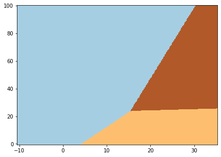
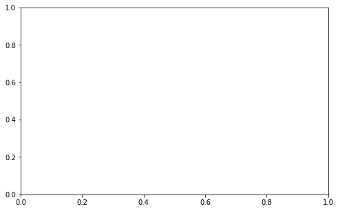
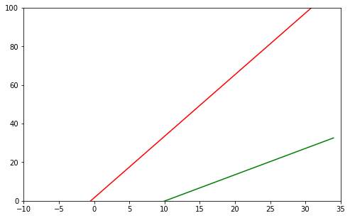
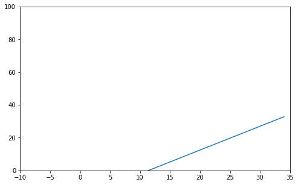

# WORK IN PROGRESS

Just a messy notebook I used to generate some synthetic data and labels, to build a simple ML model and get coefficients for decision boundaries, used later in my Rust code on STM32F1 with BME280 environment sensor.

The idea is the following: 
- collect weather data: temperature (T) in Celsius degrees and relative humidity (H) in %,
- label such (T, H) pairs as "nice", "OK" or "bad", according to what it feels like with such T and H,
- build a machine learning model using this data, so that we can predict the comfort level based on T and H,
- encode said model into a microcontroller firmware, so that the microcontroller can tell us, based on its sensor readings, whether it's "nice", "OK", or "bad".

Ideally the data collection would be done with multiple users, labelling their current environment conditions as one of the three (or more) classes, so that after a while we could have a big table with three columns: "temperature", "humidity", "comfort level". Then we could build our model using the collected data. 
As I didn't have neither time nor patience to run this for many days and label my data points, I created a synthetic dataset. 

This is of course a very simple case, and not particularly useful. After all, we could simply solve this problem with a few if/else/and lines of code, no need to build a machine learning model. Synthetic or not, the rules are relatively simple: if it's cold and humid, it's unpleasant, warm and dry feels nice, and something in between will be so-so, neither great not terrible. 

This all changes, though, when we have multiple features and we can't really tell right away which of them influences the outcome, and how. That's where machine learning really shines.


```python
import pandas as pd
```


```python
import random
```

So here's the synthetic dataset. I created 10000 pairs of temperature (between -10 and +35 C) and humidity (between 0 and 100%). Then I had to label them. 


```python
n = 10000
```


```python
# generate random values in range from -10 to 35 for temperature and 0 to 100 for humidity

data = pd.DataFrame({'temp': [random.random() * 45 - 10 for _ in range(n)], 
                     'hum': [random.random() * 100 for _ in range(n)]})
```


```python
# check if generated values look OK

data.describe()
```


<div>
<style scoped>
    .dataframe tbody tr th:only-of-type {
        vertical-align: middle;
    }

    .dataframe tbody tr th {
        vertical-align: top;
    }

    .dataframe thead th {
        text-align: right;
    }
</style>
<table border="1" class="dataframe">
  <thead>
    <tr style="text-align: right;">
      <th></th>
      <th>temp</th>
      <th>hum</th>
    </tr>
  </thead>
  <tbody>
    <tr>
      <th>count</th>
      <td>10000.000000</td>
      <td>10000.000000</td>
    </tr>
    <tr>
      <th>mean</th>
      <td>12.468410</td>
      <td>49.642732</td>
    </tr>
    <tr>
      <th>std</th>
      <td>12.914089</td>
      <td>28.639811</td>
    </tr>
    <tr>
      <th>min</th>
      <td>-9.991212</td>
      <td>0.003738</td>
    </tr>
    <tr>
      <th>25%</th>
      <td>1.292905</td>
      <td>25.208838</td>
    </tr>
    <tr>
      <th>50%</th>
      <td>12.448255</td>
      <td>49.527754</td>
    </tr>
    <tr>
      <th>75%</th>
      <td>23.503272</td>
      <td>73.888507</td>
    </tr>
    <tr>
      <th>max</th>
      <td>34.996883</td>
      <td>99.990031</td>
    </tr>
  </tbody>
</table>
</div>


I started with labelling temperature and humidity separately:


```python
# humidity below 25% is considered 'dry', above 70%: 'humid', otherwise it's moderate

data.loc[data['hum'] < 25, 'hum_cat'] = 'dry'
data.loc[data['hum'] > 70, 'hum_cat'] = 'humid'
data.loc[data['hum_cat'].isna(), 'hum_cat'] = 'moderate'

```


```python
# temperature below 10°C is considered 'cold', above 22°C: 'warm', otherwise it's moderate
```


```python
data.loc[data['temp'] < 10, 'temp_cat'] = 'cold'
data.loc[data['temp'] > 22, 'temp_cat'] = 'warm'
data.loc[data['temp_cat'].isna(), 'temp_cat'] = 'moderate'
```


```python
data.head()
```


<div>
<style scoped>
    .dataframe tbody tr th:only-of-type {
        vertical-align: middle;
    }

    .dataframe tbody tr th {
        vertical-align: top;
    }

    .dataframe thead th {
        text-align: right;
    }
</style>
<table border="1" class="dataframe">
  <thead>
    <tr style="text-align: right;">
      <th></th>
      <th>temp</th>
      <th>hum</th>
      <th>hum_cat</th>
      <th>temp_cat</th>
    </tr>
  </thead>
  <tbody>
    <tr>
      <th>0</th>
      <td>6.943300</td>
      <td>73.581285</td>
      <td>humid</td>
      <td>cold</td>
    </tr>
    <tr>
      <th>1</th>
      <td>31.472253</td>
      <td>69.509132</td>
      <td>moderate</td>
      <td>warm</td>
    </tr>
    <tr>
      <th>2</th>
      <td>19.402034</td>
      <td>41.429291</td>
      <td>moderate</td>
      <td>moderate</td>
    </tr>
    <tr>
      <th>3</th>
      <td>18.631376</td>
      <td>86.497069</td>
      <td>humid</td>
      <td>moderate</td>
    </tr>
    <tr>
      <th>4</th>
      <td>34.347380</td>
      <td>25.864733</td>
      <td>moderate</td>
      <td>warm</td>
    </tr>
  </tbody>
</table>
</div>


Then I combined the two columns, to get more "human" description of the conditions.


```python
# combine the two columns
data['weather'] = data['temp_cat'] + ' ' + data['hum_cat']
```

There are 9 possible combinations:


```python
data['weather'].unique()
```


    array(['cold humid', 'warm moderate', 'moderate moderate',
           'moderate humid', 'cold moderate', 'warm humid', 'moderate dry',
           'cold dry', 'warm dry'], dtype=object)


Weather is classified as one of three classes: 'nice', 'average', 'bad'


```python
weathercats = ['nice', 'ok', 'bad']
```

This create three very distinct groups, so to make it more realistic we add some noise. Each group will be labeled with 85% probability with the "correct" label, and with 10% and 5% probability with one of the other two label. 
Such randomization is supposed to simulate how various respondents in our data collection could feel about the same condtions: if we were collecting data from a 100 users, some of them could actually feel like the "cold and humid" was "OK", or that warm and dry was "bad". 


```python
# create lists with 85% of "correct" labels, and 10% and 5% of the remaining "incorrect" labels

random_cats = {}

for idx, cat in enumerate(weathercats):
    output = [weathercats[idx] for _ in range(17)] + [weathercats[idx-1] for _ in range(2)] + [weathercats[idx-2]]
    random_cats[cat] = output

    

```


```python
def randomizer(row, cat):
    return random.choice(random_cats[cat])
```


```python
data['weather_cat'] = ''
```

This is the actual labelling. We consider "warm dry" and "moderate dry" as nice, "warm moderate" and "moderate moderate" "OK", everything else is "bad". This is oversimplified, but for this experiment will do.


```python
# weather is considered 'nice' if it's either warm and dry, or moderate temperature and dry 
data.loc[data['weather'].isin(['warm dry', 'moderate dry']), 'weather_cat'] \
= data.loc[data['weather'].isin(['warm dry', 'moderate dry']), 'weather_cat'].apply(lambda row: randomizer(row,'nice'))
```


```python
# weather is considered 'bad' when it's cold and/od humid
data.loc[data['weather'].isin(['cold humid', 'moderate humid', 'cold moderate', 'warm humid', 'cold dry']), 'weather_cat'] \
= data.loc[data['weather'].isin(['cold humid', 'moderate humid', 'cold moderate', 'warm humid', 'cold dry']), 'weather_cat'] \
.apply(lambda row: randomizer(row, 'bad'))
```


```python
# if it's some other combination, then the weather is considered 'ok'
data.loc[data['weather'].isin(['warm moderate','moderate moderate']), 'weather_cat'] \
= data.loc[data['weather'].isin(['warm moderate','moderate moderate']), 'weather_cat'] \
.apply(lambda row: randomizer(row, 'ok'))
```


```python

```


```python
data.head()
```


<div>
<style scoped>
    .dataframe tbody tr th:only-of-type {
        vertical-align: middle;
    }

    .dataframe tbody tr th {
        vertical-align: top;
    }

    .dataframe thead th {
        text-align: right;
    }
</style>
<table border="1" class="dataframe">
  <thead>
    <tr style="text-align: right;">
      <th></th>
      <th>temp</th>
      <th>hum</th>
      <th>hum_cat</th>
      <th>temp_cat</th>
      <th>weather</th>
      <th>weather_cat</th>
    </tr>
  </thead>
  <tbody>
    <tr>
      <th>0</th>
      <td>21.470655</td>
      <td>83.023716</td>
      <td>humid</td>
      <td>moderate</td>
      <td>moderate humid</td>
      <td>bad</td>
    </tr>
    <tr>
      <th>1</th>
      <td>28.616161</td>
      <td>6.045310</td>
      <td>dry</td>
      <td>warm</td>
      <td>warm dry</td>
      <td>nice</td>
    </tr>
    <tr>
      <th>2</th>
      <td>0.891287</td>
      <td>5.042417</td>
      <td>dry</td>
      <td>cold</td>
      <td>cold dry</td>
      <td>bad</td>
    </tr>
    <tr>
      <th>3</th>
      <td>25.486470</td>
      <td>88.557170</td>
      <td>humid</td>
      <td>warm</td>
      <td>warm humid</td>
      <td>bad</td>
    </tr>
    <tr>
      <th>4</th>
      <td>32.860472</td>
      <td>65.405922</td>
      <td>moderate</td>
      <td>warm</td>
      <td>warm moderate</td>
      <td>ok</td>
    </tr>
  </tbody>
</table>
</div>


```python
import matplotlib.pyplot as plt
```

This is what our points look like on a scatter plot chart. 


```python
# plot all the data points

fig, ax = plt.subplots(figsize = (12,10))
for cat in data['weather_cat'].unique():
    plt.scatter(x = data.loc[data['weather_cat'] == cat, 'temp'], y = data.loc[data['weather_cat'] == cat, 'hum'], s = 4)
ax.set_ylabel('humidity %')
ax.set_xlabel('temperature ')
ax.legend(['bad', 'nice', 'ok'])
```


    <matplotlib.legend.Legend at 0x7feb1b610a10>


```python

```

Our labels are human-readable, but will not work for a machine learning algorithm. They have to be converted into numeric categories.


```python
data['weather_cat'] = pd.Categorical(data['weather_cat'])
```


```python
data['weather_cat_idx'] = data['weather_cat'].cat.codes
```


```python
# bad is 0, nice is 1, ok is 2

data.head()
```


<div>
<style scoped>
    .dataframe tbody tr th:only-of-type {
        vertical-align: middle;
    }

    .dataframe tbody tr th {
        vertical-align: top;
    }

    .dataframe thead th {
        text-align: right;
    }
</style>
<table border="1" class="dataframe">
  <thead>
    <tr style="text-align: right;">
      <th></th>
      <th>temp</th>
      <th>hum</th>
      <th>hum_cat</th>
      <th>temp_cat</th>
      <th>weather</th>
      <th>weather_cat</th>
      <th>weather_cat_idx</th>
    </tr>
  </thead>
  <tbody>
    <tr>
      <th>0</th>
      <td>6.943300</td>
      <td>73.581285</td>
      <td>humid</td>
      <td>cold</td>
      <td>cold humid</td>
      <td>bad</td>
      <td>0</td>
    </tr>
    <tr>
      <th>1</th>
      <td>31.472253</td>
      <td>69.509132</td>
      <td>moderate</td>
      <td>warm</td>
      <td>warm moderate</td>
      <td>ok</td>
      <td>2</td>
    </tr>
    <tr>
      <th>2</th>
      <td>19.402034</td>
      <td>41.429291</td>
      <td>moderate</td>
      <td>moderate</td>
      <td>moderate moderate</td>
      <td>nice</td>
      <td>1</td>
    </tr>
    <tr>
      <th>3</th>
      <td>18.631376</td>
      <td>86.497069</td>
      <td>humid</td>
      <td>moderate</td>
      <td>moderate humid</td>
      <td>bad</td>
      <td>0</td>
    </tr>
    <tr>
      <th>4</th>
      <td>34.347380</td>
      <td>25.864733</td>
      <td>moderate</td>
      <td>warm</td>
      <td>warm moderate</td>
      <td>nice</td>
      <td>1</td>
    </tr>
  </tbody>
</table>
</div>


```python

```

We use Logistic Regression, a linear classifier model.

# TO DO
- add test/train split
- find out how good the model is
- experiment with some different hyperparameters if possible

- describe the technique used to create the decision boundaries for the MCU: one vs rest


```python
from sklearn.linear_model import LogisticRegression
```


```python
X = data[['temp', 'hum']]
```


```python
y = data['weather_cat_idx']
```


```python
logreg = LogisticRegression(C = 1e5)
```


```python
logreg.fit(X,y)
```

    /home/nebelgrau/miniconda3/envs/minimal_ds/lib/python3.7/site-packages/sklearn/linear_model/logistic.py:432: FutureWarning: Default solver will be changed to 'lbfgs' in 0.22. Specify a solver to silence this warning.
      FutureWarning)
    /home/nebelgrau/miniconda3/envs/minimal_ds/lib/python3.7/site-packages/sklearn/linear_model/logistic.py:469: FutureWarning: Default multi_class will be changed to 'auto' in 0.22. Specify the multi_class option to silence this warning.
      "this warning.", FutureWarning)


    LogisticRegression(C=100000.0, class_weight=None, dual=False,
                       fit_intercept=True, intercept_scaling=1, l1_ratio=None,
                       max_iter=100, multi_class='warn', n_jobs=None, penalty='l2',
                       random_state=None, solver='warn', tol=0.0001, verbose=0,
                       warm_start=False)


```python
logreg.coef_
```


    array([[-0.101244  ,  0.03045919],
           [ 0.06477301, -0.04756651],
           [ 0.06044765, -0.00114402]])


```python
logreg.intercept_
```


    array([-0.00954335, -0.69743214, -1.7391654 ])


```python
x_min, x_max = X.iloc[:,0].min() - .5, X.iloc[:,0].max() + .5, 
```


```python
y_min, y_max = X.iloc[:,1].min() - .5, X.iloc[:,1].max() + .5, 
```


```python
h = .2 # step in the mesh
```


```python
import numpy as np
```


```python
xx, yy = np.meshgrid(np.arange(x_min, x_max, h), np.arange(y_min, y_max, h))
```


```python
Z = logreg.predict(np.c_[xx.ravel(), yy.ravel()])
```


```python
Z = Z.reshape(xx.shape)
```


```python
plt.figure(1, figsize = (7,5))
plt.pcolormesh(xx, yy, Z, cmap = plt.cm.Paired)
```


    <matplotlib.collections.QuadMesh at 0x7feae3ab7a50>





```python
data.info()
```

    <class 'pandas.core.frame.DataFrame'>
    RangeIndex: 10000 entries, 0 to 9999
    Data columns (total 7 columns):
     #   Column           Non-Null Count  Dtype   
    ---  ------           --------------  -----   
     0   temp             10000 non-null  float64 
     1   hum              10000 non-null  float64 
     2   hum_cat          10000 non-null  object  
     3   temp_cat         10000 non-null  object  
     4   weather          10000 non-null  object  
     5   weather_cat      10000 non-null  category
     6   weather_cat_idx  10000 non-null  int8    
    dtypes: category(1), float64(2), int8(1), object(3)
    memory usage: 410.4+ KB


```python
data['weather_cat'].unique()
```


    [bad, ok, nice]
    Categories (3, object): [bad, ok, nice]


```python
# get the two boundaries for 'nice' and for 'bad'
```


```python
data.loc[data['weather_cat'] == 'nice', 'nice'] = 1
```


```python
data.loc[data['nice'].isna(), 'nice'] = 0 
```


```python

```


```python
data.loc[data['weather_cat'] == 'bad', 'bad'] = 1
```


```python
data.loc[data['bad'].isna(), 'bad'] = 0 
```


```python
data.head()
```


<div>
<style scoped>
    .dataframe tbody tr th:only-of-type {
        vertical-align: middle;
    }

    .dataframe tbody tr th {
        vertical-align: top;
    }

    .dataframe thead th {
        text-align: right;
    }
</style>
<table border="1" class="dataframe">
  <thead>
    <tr style="text-align: right;">
      <th></th>
      <th>temp</th>
      <th>hum</th>
      <th>hum_cat</th>
      <th>temp_cat</th>
      <th>weather</th>
      <th>weather_cat</th>
      <th>weather_cat_idx</th>
      <th>nice</th>
      <th>bad</th>
    </tr>
  </thead>
  <tbody>
    <tr>
      <th>0</th>
      <td>21.470655</td>
      <td>83.023716</td>
      <td>humid</td>
      <td>moderate</td>
      <td>moderate humid</td>
      <td>bad</td>
      <td>0</td>
      <td>0.0</td>
      <td>1.0</td>
    </tr>
    <tr>
      <th>1</th>
      <td>28.616161</td>
      <td>6.045310</td>
      <td>dry</td>
      <td>warm</td>
      <td>warm dry</td>
      <td>nice</td>
      <td>1</td>
      <td>1.0</td>
      <td>0.0</td>
    </tr>
    <tr>
      <th>2</th>
      <td>0.891287</td>
      <td>5.042417</td>
      <td>dry</td>
      <td>cold</td>
      <td>cold dry</td>
      <td>bad</td>
      <td>0</td>
      <td>0.0</td>
      <td>1.0</td>
    </tr>
    <tr>
      <th>3</th>
      <td>25.486470</td>
      <td>88.557170</td>
      <td>humid</td>
      <td>warm</td>
      <td>warm humid</td>
      <td>bad</td>
      <td>0</td>
      <td>0.0</td>
      <td>1.0</td>
    </tr>
    <tr>
      <th>4</th>
      <td>32.860472</td>
      <td>65.405922</td>
      <td>moderate</td>
      <td>warm</td>
      <td>warm moderate</td>
      <td>ok</td>
      <td>2</td>
      <td>0.0</td>
      <td>0.0</td>
    </tr>
  </tbody>
</table>
</div>


```python
# logistic regression for 'nice' vs. everything else
```


```python
X = data[['temp', 'hum']] 

```


```python
y = data['nice']
```


```python
logreg.fit(X,y)
```

    /home/nebelgrau/miniconda3/envs/minimal_ds/lib/python3.7/site-packages/sklearn/linear_model/logistic.py:432: FutureWarning: Default solver will be changed to 'lbfgs' in 0.22. Specify a solver to silence this warning.
      FutureWarning)


    LogisticRegression(C=100000.0, class_weight=None, dual=False,
                       fit_intercept=True, intercept_scaling=1, l1_ratio=None,
                       max_iter=100, multi_class='warn', n_jobs=None, penalty='l2',
                       random_state=None, solver='warn', tol=0.0001, verbose=0,
                       warm_start=False)


```python
W_nice, b_nice = logreg.coef_, logreg.intercept_
```


```python
W_nice

```


    array([[ 0.06477301, -0.04756651]])


```python
b_nice
```


    array([-0.69743214])


```python
logreg.predict(X)
```


    array([0., 0., 0., ..., 1., 0., 1.])


```python
fig, ax = plt.subplots(figsize = (8,5))
plt.scatter(X,y, c = 'r')
```


    ---------------------------------------------------------------------------

    ValueError                                Traceback (most recent call last)

    <ipython-input-54-630efe1772d1> in <module>
          1 fig, ax = plt.subplots(figsize = (8,5))
    ----> 2 plt.scatter(X,y, c = 'r')
    

    ~/miniconda3/envs/minimal_ds/lib/python3.7/site-packages/matplotlib/pyplot.py in scatter(x, y, s, c, marker, cmap, norm, vmin, vmax, alpha, linewidths, verts, edgecolors, plotnonfinite, data, **kwargs)
       2845         verts=verts, edgecolors=edgecolors,
       2846         plotnonfinite=plotnonfinite, **({"data": data} if data is not
    -> 2847         None else {}), **kwargs)
       2848     sci(__ret)
       2849     return __ret


    ~/miniconda3/envs/minimal_ds/lib/python3.7/site-packages/matplotlib/__init__.py in inner(ax, data, *args, **kwargs)
       1599     def inner(ax, *args, data=None, **kwargs):
       1600         if data is None:
    -> 1601             return func(ax, *map(sanitize_sequence, args), **kwargs)
       1602 
       1603         bound = new_sig.bind(ax, *args, **kwargs)


    ~/miniconda3/envs/minimal_ds/lib/python3.7/site-packages/matplotlib/axes/_axes.py in scatter(self, x, y, s, c, marker, cmap, norm, vmin, vmax, alpha, linewidths, verts, edgecolors, plotnonfinite, **kwargs)
       4442         y = np.ma.ravel(y)
       4443         if x.size != y.size:
    -> 4444             raise ValueError("x and y must be the same size")
       4445 
       4446         if s is None:


    ValueError: x and y must be the same size





```python
x = np.arange(-10,35)
```


```python
y = -(x * W_nice[0][0] + b_nice[0]) / W_nice[0][1]
```


```python
fig, ax = plt.subplots(figsize = (8,5))
ax.set_xlim(-10,35)
ax.set_ylim(0,100)
plt.plot(x, y)
```


    [<matplotlib.lines.Line2D at 0x7f52b54fc550>]


```python

```


```python
X = data[['temp', 'hum']] 

```


```python
y = data['bad']
```


```python
logreg.fit(X,y)
```

    /home/nebelgrau/miniconda3/envs/minimal_ds/lib/python3.7/site-packages/sklearn/linear_model/logistic.py:432: FutureWarning: Default solver will be changed to 'lbfgs' in 0.22. Specify a solver to silence this warning.
      FutureWarning)


    LogisticRegression(C=100000.0, class_weight=None, dual=False,
                       fit_intercept=True, intercept_scaling=1, l1_ratio=None,
                       max_iter=100, multi_class='warn', n_jobs=None, penalty='l2',
                       random_state=None, solver='warn', tol=0.0001, verbose=0,
                       warm_start=False)


```python
W_bad, b_bad = logreg.coef_, logreg.intercept_
```


```python
W_bad

```


    array([[-0.09984133,  0.03128328]])


```python
b_bad
```


    array([-0.04756169])


```python
t = np.arange(-10,35)
```


```python
h_nice = -(t * W_nice[0][0] + b_nice[0]) / W_nice[0][1]
```


```python
h_bad = -(t * W_bad[0][0] + b_bad[0]) / W_bad[0][1]
```


```python
fig, ax = plt.subplots(figsize = (8,5))
ax.set_xlim(-10,35)
ax.set_ylim(0,100)
plt.plot(t, h_nice, c = 'g')
plt.plot(t, h_bad, c = 'r')

```


    [<matplotlib.lines.Line2D at 0x7f52b54d1d90>]





```python
samples = [(25,70), (10,15), (24,23), (21,60), (7,60), (23,15), (28,80)]
```


```python

```


```python
for sample in samples:
    t, h = sample
    
    h_nice = -(t * W_nice[0][0] + b_nice[0]) / W_nice[0][1]
    h_bad = -(t * W_bad[0][0] + b_bad[0]) / W_bad[0][1]
    
    print("temp {}°C, hum {}% - hum_nice {}%, hum_bad {}%".format(t,h,h_nice, h_bad))
    
    if h >= h_bad:
        print("temp: {}°C, hum: {}% - bad! :(".format(t,h))
    elif h <= h_nice:
        print("temp: {}°C, hum: {}% - nice! :) ".format(t,h))
    else:
        print("temp: {}°C, hum: {}% - it's ok.".format(t,h))
    
```

    temp 25°C, hum 70% - hum_nice 19.71291557867815%, hum_bad 81.24403029375354%
    temp: 25°C, hum: 70% - it's ok.
    temp 10°C, hum 15% - hum_nice -2.060170511303494%, hum_bad 32.985203098168974%
    temp: 10°C, hum: 15% - it's ok.
    temp 24°C, hum 23% - hum_nice 18.261376506012706%, hum_bad 78.02677514738124%
    temp: 24°C, hum: 23% - it's ok.
    temp 21°C, hum 60% - hum_nice 13.906759288016376%, hum_bad 68.37500970826433%
    temp: 21°C, hum: 60% - it's ok.
    temp 7°C, hum 60% - hum_nice -6.414787729299824%, hum_bad 23.333437659052063%
    temp: 7°C, hum: 60% - bad! :(
    temp 23°C, hum 15% - hum_nice 16.809837433347266%, hum_bad 74.80952000100895%
    temp: 23°C, hum: 15% - nice! :) 
    temp 28°C, hum 80% - hum_nice 24.06753279667448%, hum_bad 90.89579573287047%
    temp: 28°C, hum: 80% - it's ok.


```python

```


```python
from sklearn.preprocessing import PolynomialFeatures
```


```python
from sklearn.pipeline import Pipeline
```


```python
from sklearn.model_selection import train_test_split

```


```python
X = data[['hum', 'temp']]
```


```python
y = data['nice']
```


```python
poly = PolynomialFeatures(degree = 2, interaction_only = False, include_bias = False)
```


```python
X_train, X_test, y_train, y_test = train_test_split(X,y)
```


```python
X_train.shape
```


    (7500, 2)


```python
X_poly = poly.fit_transform(X_train)
```


```python
X_poly.shape
```


    (7500, 5)


```python
lr = LogisticRegression()
```


```python
lr.fit(X_poly, y_train)
```

    /home/nebelgrau/miniconda3/envs/minimal_ds/lib/python3.7/site-packages/sklearn/linear_model/logistic.py:432: FutureWarning: Default solver will be changed to 'lbfgs' in 0.22. Specify a solver to silence this warning.
      FutureWarning)


    LogisticRegression(C=1.0, class_weight=None, dual=False, fit_intercept=True,
                       intercept_scaling=1, l1_ratio=None, max_iter=100,
                       multi_class='warn', n_jobs=None, penalty='l2',
                       random_state=None, solver='warn', tol=0.0001, verbose=0,
                       warm_start=False)


```python
lr.score(poly.transform(X_test), y_test)
```


    0.9024


```python
lr.coef_
```


    array([[-0.09122892,  0.20392801,  0.00076299, -0.00183054, -0.00258896]])


```python
lr.intercept_
```


    array([-0.69309577])


```python
coefs = lr.coef_
```


```python
intercept = lr.intercept_
```


```python
X_train
```


<div>
<style scoped>
    .dataframe tbody tr th:only-of-type {
        vertical-align: middle;
    }

    .dataframe tbody tr th {
        vertical-align: top;
    }

    .dataframe thead th {
        text-align: right;
    }
</style>
<table border="1" class="dataframe">
  <thead>
    <tr style="text-align: right;">
      <th></th>
      <th>hum</th>
      <th>temp</th>
    </tr>
  </thead>
  <tbody>
    <tr>
      <th>1405</th>
      <td>67.395464</td>
      <td>10.150922</td>
    </tr>
    <tr>
      <th>4811</th>
      <td>29.313819</td>
      <td>-6.109871</td>
    </tr>
    <tr>
      <th>3430</th>
      <td>18.761767</td>
      <td>17.954899</td>
    </tr>
    <tr>
      <th>9121</th>
      <td>41.268629</td>
      <td>4.066631</td>
    </tr>
    <tr>
      <th>2398</th>
      <td>93.655351</td>
      <td>-4.108573</td>
    </tr>
    <tr>
      <th>...</th>
      <td>...</td>
      <td>...</td>
    </tr>
    <tr>
      <th>7423</th>
      <td>54.693889</td>
      <td>23.541253</td>
    </tr>
    <tr>
      <th>61</th>
      <td>17.386110</td>
      <td>15.910263</td>
    </tr>
    <tr>
      <th>655</th>
      <td>35.974192</td>
      <td>26.260840</td>
    </tr>
    <tr>
      <th>5107</th>
      <td>68.008626</td>
      <td>34.832801</td>
    </tr>
    <tr>
      <th>9999</th>
      <td>1.532594</td>
      <td>7.270842</td>
    </tr>
  </tbody>
</table>
<p>7500 rows × 2 columns</p>
</div>


```python
df = X_train.copy(deep = True)
```


```python
df['hum^2'] = df['hum']*df['hum']
```


```python
df.head()
```


<div>
<style scoped>
    .dataframe tbody tr th:only-of-type {
        vertical-align: middle;
    }

    .dataframe tbody tr th {
        vertical-align: top;
    }

    .dataframe thead th {
        text-align: right;
    }
</style>
<table border="1" class="dataframe">
  <thead>
    <tr style="text-align: right;">
      <th></th>
      <th>hum</th>
      <th>temp</th>
      <th>hum^2</th>
      <th>hum*temp</th>
    </tr>
  </thead>
  <tbody>
    <tr>
      <th>1405</th>
      <td>67.395464</td>
      <td>10.150922</td>
      <td>4542.148591</td>
      <td>684.126126</td>
    </tr>
    <tr>
      <th>4811</th>
      <td>29.313819</td>
      <td>-6.109871</td>
      <td>859.299977</td>
      <td>-179.103647</td>
    </tr>
    <tr>
      <th>3430</th>
      <td>18.761767</td>
      <td>17.954899</td>
      <td>352.003899</td>
      <td>336.865630</td>
    </tr>
    <tr>
      <th>9121</th>
      <td>41.268629</td>
      <td>4.066631</td>
      <td>1703.099700</td>
      <td>167.824268</td>
    </tr>
    <tr>
      <th>2398</th>
      <td>93.655351</td>
      <td>-4.108573</td>
      <td>8771.324809</td>
      <td>-384.789825</td>
    </tr>
  </tbody>
</table>
</div>


```python
df['hum*temp'] = df['hum']*df['temp']
```


```python
df['temp^2'] = df['temp']*df['temp']
```


```python
X_poly
```


    array([[ 6.73954642e+01,  1.01509224e+01,  4.54214859e+03,
             6.84126126e+02,  1.03041225e+02],
           [ 2.93138189e+01, -6.10987084e+00,  8.59299977e+02,
            -1.79103647e+02,  3.73305216e+01],
           [ 1.87617669e+01,  1.79548990e+01,  3.52003899e+02,
             3.36865630e+02,  3.22378397e+02],
           ...,
           [ 3.59741916e+01,  2.62608401e+01,  1.29414246e+03,
             9.44712493e+02,  6.89631721e+02],
           [ 6.80086255e+01,  3.48328008e+01,  4.62517315e+03,
             2.36893090e+03,  1.21332401e+03],
           [ 1.53259427e+00,  7.27084206e+00,  2.34884520e+00,
             1.11432509e+01,  5.28651442e+01]])


```python
'''
f(x,y,c) = c0 + c1x + c2y + c3x2 + c4xy + c5y2 

'''

```


```python
samples
```


    [(10, 40), (15, 80), (20, 20), (21, 70), (10, 90), (23, 10), (30, 25)]


```python
intercept[0]
```


    -0.6930957744600087


```python
coefs[0]
```


    array([-0.09122892,  0.20392801,  0.00076299, -0.00183054, -0.00258896])


```python
def f(x,y):
    return intercept[0] + x*coefs[0][0] + y*coefs[0][1] + x*x*coefs[0][2] + x*y*coefs[0][3] + y*y*coefs[0][4]
```


```python
for sample in samples:
    print(sample[0], sample[1], f(sample[0], sample[1]))
```

    10 40 1.7534785691637973
    15 80 -4.341625791150808
    20 20 0.09828297383015894
    21 70 -3.3742722854597815
    10 90 -5.793652672391882
    23 10 -1.028377889576459
    30 25 -0.6360746689228136


```python
x = np.arange(30)
```


```python
x.shape
```


    (30,)


```python
lr.predict?
```


    Signature: lr.predict(X)
    Docstring:
    Predict class labels for samples in X.
    
    Parameters
    ----------
    X : array_like or sparse matrix, shape (n_samples, n_features)
        Samples.
    
    Returns
    -------
    C : array, shape [n_samples]
        Predicted class label per sample.
    File:      ~/miniconda3/envs/minimal_ds/lib/python3.7/site-packages/sklearn/linear_model/base.py
    Type:      method


```python
fig, ax = plt.subplots(figsize = (8,5))
plt.plot(x, lr.predict(x))
```


    ---------------------------------------------------------------------------

    ValueError                                Traceback (most recent call last)

    <ipython-input-131-a567e8312f7c> in <module>
          1 fig, ax = plt.subplots(figsize = (8,5))
    ----> 2 plt.plot(x, lr.predict(x))
    

    ~/miniconda3/envs/minimal_ds/lib/python3.7/site-packages/sklearn/linear_model/base.py in predict(self, X)
        287             Predicted class label per sample.
        288         """
    --> 289         scores = self.decision_function(X)
        290         if len(scores.shape) == 1:
        291             indices = (scores > 0).astype(np.int)


    ~/miniconda3/envs/minimal_ds/lib/python3.7/site-packages/sklearn/linear_model/base.py in decision_function(self, X)
        263                                  "yet" % {'name': type(self).__name__})
        264 
    --> 265         X = check_array(X, accept_sparse='csr')
        266 
        267         n_features = self.coef_.shape[1]


    ~/miniconda3/envs/minimal_ds/lib/python3.7/site-packages/sklearn/utils/validation.py in check_array(array, accept_sparse, accept_large_sparse, dtype, order, copy, force_all_finite, ensure_2d, allow_nd, ensure_min_samples, ensure_min_features, warn_on_dtype, estimator)
        519                     "Reshape your data either using array.reshape(-1, 1) if "
        520                     "your data has a single feature or array.reshape(1, -1) "
    --> 521                     "if it contains a single sample.".format(array))
        522 
        523         # in the future np.flexible dtypes will be handled like object dtypes


    ValueError: Expected 2D array, got 1D array instead:
    array=[ 0  1  2  3  4  5  6  7  8  9 10 11 12 13 14 15 16 17 18 19 20 21 22 23
     24 25 26 27 28 29].
    Reshape your data either using array.reshape(-1, 1) if your data has a single feature or array.reshape(1, -1) if it contains a single sample.


```python
'''
Once the model is fit we call .coef_ and .intercept_ to see the predicted coefficients and intercept term. 
Following the linear form Y = Mx + b we can now see the linear equation for our decision boundary is 
Sepal_Length * (0.4437) + Petal_Width * (-4.6018) + 0.9626. 

so that's SL * W[0] + PW * W[1] + b

SL is X, PW is Y

so PW * W[1] = -SL * W[0] - b
therefore PW = -(SL*W[0] + b) / W[1]
'''


```


```python

```


```python

```


```python
X = data[['hum', 'temp']]
```


```python
y = data['nice']
```


```python
poly = PolynomialFeatures(degree = 2, interaction_only = False, include_bias = False)
```


```python
X_train, X_test, y_train, y_test = train_test_split(X,y)
```


```python
X_train.shape
```


    (7500, 2)


```python
X_poly = poly.fit_transform(X_train)
```


```python
X_poly.shape
```


    (7500, 5)


```python
lr = LogisticRegression()
```


```python
lr.fit(X_poly, y_train)
```

    /home/nebelgrau/miniconda3/envs/minimal_ds/lib/python3.7/site-packages/sklearn/linear_model/logistic.py:432: FutureWarning: Default solver will be changed to 'lbfgs' in 0.22. Specify a solver to silence this warning.
      FutureWarning)


    LogisticRegression(C=1.0, class_weight=None, dual=False, fit_intercept=True,
                       intercept_scaling=1, l1_ratio=None, max_iter=100,
                       multi_class='warn', n_jobs=None, penalty='l2',
                       random_state=None, solver='warn', tol=0.0001, verbose=0,
                       warm_start=False)


```python
lr.score(poly.transform(X_test), y_test)
```


    0.8984


```python
W = lr.coef_
```


```python
W
```


    array([[-0.08605272,  0.19827515,  0.00075882, -0.00193614, -0.00202101]])


```python
b = lr.intercept_
```


```python
b
```


    array([-0.95894752])


```python
'''
f(x,y; c) = c_0 + c_1 x + c_2 y + c_3 x² + c_4 x y + c_5 y²


linear: 

f(x,y;c) = c_0 + c_1 x + c_2 y
Y = Mx + b -> Y*c2 = - x*c1  - c0 -> Y = -(x*c1 + c0) / c2


c4xy + c5y2 +c2y = - c0 - c1x - c3x2

(c4x + c5y + c2)y = -c0 - c1x - c3x2


'''


```


```python

```


```python
def result(x,y):
    return b[0] + W[0][0]*x + W[0][1]*y + W[0][2]*x*x + W[0][3]*x*y + W[0][4]*y*y
```


```python
samples = [(25,70), (10,15), (24,23), (21,60), (7,60), (23,15), (28,80)]
```


```python
for sample in samples:
    print(sample[0], sample[1], result(sample[0], sample[1]))
```

    25 70 -2.0479145113402613
    10 15 0.4853876847428495
    24 23 -0.16466236681893487
    21 60 -0.250062424707326
    7 60 2.2835722283676736
    23 15 -0.6853089916736277
    28 80 -4.1828858438687675


```python

```


```python

```


```python

```


```python
W_nice

```


    array([[ 0.06826359, -0.04702842]])


```python
b_nice
```


    array([-0.77952247])


```python
x = np.arange(-10,35)
```


```python
y = -(x * W_nice[0][0] + b_nice[0]) / W_nice[0][1]
```


```python
fig, ax = plt.subplots(figsize = (8,5))
ax.set_xlim(-10,35)
ax.set_ylim(0,100)
plt.plot(x, y)
```


    [<matplotlib.lines.Line2D at 0x7fde54be6d90>]





```python

```


```python
samples = [(10,40), (15,80), (20,20), (21,70), (10,90), (23, 10), (30,25)]
```


```python
for sample in samples:
    print(sample[0]*0.06826359 + sample[1]*-0.04702842 + (-0.77952247))
```

    -1.9780233700000003
    -3.5178422200000004
    -0.3548190700000001
    -2.6379764800000003
    -4.32944437
    0.3202558999999999
    0.09267473000000004

