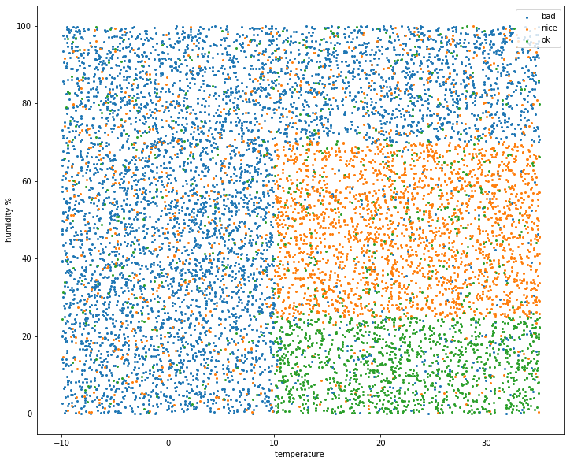
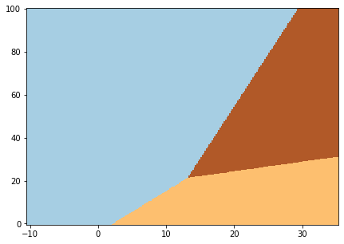
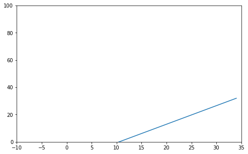
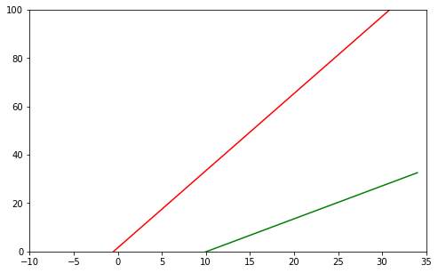

# WORK IN PROGRESS

Just a messy notebook I used to generate some synthetic data and labels, to build a simple ML model and get coefficients for decision boundaries, used later in my Rust code on STM32F1 with BME280 environment sensor.

The idea is the following: 
- collect weather data: temperature (T) in Celsius degrees and relative humidity (H) in %,
- label such (T, H) pairs as "nice", "OK" or "bad", according to what it feels like with such T and H,
- build a machine learning model using this data, so that we can predict the comfort level based on T and H,
- encode said model into a microcontroller firmware, so that the microcontroller can tell us, based on its sensor readings, whether it's "nice", "OK", or "bad".

Ideally the data collection would be done with multiple users, labelling their current environment conditions as one of the three (or more) classes, so that after a while we could have a big table with three columns: "temperature", "humidity", "comfort level". Then we could build our model using the collected data. 
As I didn't have neither time nor patience to run this for many days and label my data points, I created a synthetic dataset. 

This is of course a very simple case, and not particularly useful. After all, we could simply solve this problem with a few if/else/and lines of code, no need to build a machine learning model. Synthetic or not, the rules are relatively simple: if it's cold and humid, it's unpleasant, warm and dry feels nice, and something in between will be so-so, neither great not terrible. 

This all changes, though, when we have multiple features and we can't really tell right away which of them influences the outcome, and how. That's where machine learning really shines.


```python
import pandas as pd
```


```python
import random
```

So here's the synthetic dataset. I created 10000 pairs of temperature (between -10 and +35 C) and humidity (between 0 and 100%). Then I had to label them. 


```python
n = 10000
```


```python
# generate random values in range from -10 to 35 for temperature and 0 to 100 for humidity

data = pd.DataFrame({'temp': [random.random() * 45 - 10 for _ in range(n)], 
                     'hum': [random.random() * 100 for _ in range(n)]})
```


```python
# check if generated values look OK

data.describe()
```


<div>
<style scoped>
    .dataframe tbody tr th:only-of-type {
        vertical-align: middle;
    }

    .dataframe tbody tr th {
        vertical-align: top;
    }

    .dataframe thead th {
        text-align: right;
    }
</style>
<table border="1" class="dataframe">
  <thead>
    <tr style="text-align: right;">
      <th></th>
      <th>temp</th>
      <th>hum</th>
    </tr>
  </thead>
  <tbody>
    <tr>
      <th>count</th>
      <td>10000.000000</td>
      <td>10000.000000</td>
    </tr>
    <tr>
      <th>mean</th>
      <td>12.468410</td>
      <td>49.642732</td>
    </tr>
    <tr>
      <th>std</th>
      <td>12.914089</td>
      <td>28.639811</td>
    </tr>
    <tr>
      <th>min</th>
      <td>-9.991212</td>
      <td>0.003738</td>
    </tr>
    <tr>
      <th>25%</th>
      <td>1.292905</td>
      <td>25.208838</td>
    </tr>
    <tr>
      <th>50%</th>
      <td>12.448255</td>
      <td>49.527754</td>
    </tr>
    <tr>
      <th>75%</th>
      <td>23.503272</td>
      <td>73.888507</td>
    </tr>
    <tr>
      <th>max</th>
      <td>34.996883</td>
      <td>99.990031</td>
    </tr>
  </tbody>
</table>
</div>


I started with labelling temperature and humidity separately:


```python
# humidity below 25% is considered 'dry', above 70%: 'humid', otherwise it's moderate

data.loc[data['hum'] < 25, 'hum_cat'] = 'dry'
data.loc[data['hum'] > 70, 'hum_cat'] = 'humid'
data.loc[data['hum_cat'].isna(), 'hum_cat'] = 'moderate'

```


```python
# temperature below 10°C is considered 'cold', above 22°C: 'warm', otherwise it's moderate
```


```python
data.loc[data['temp'] < 10, 'temp_cat'] = 'cold'
data.loc[data['temp'] > 22, 'temp_cat'] = 'warm'
data.loc[data['temp_cat'].isna(), 'temp_cat'] = 'moderate'
```


```python
data.head()
```


<div>
<style scoped>
    .dataframe tbody tr th:only-of-type {
        vertical-align: middle;
    }

    .dataframe tbody tr th {
        vertical-align: top;
    }

    .dataframe thead th {
        text-align: right;
    }
</style>
<table border="1" class="dataframe">
  <thead>
    <tr style="text-align: right;">
      <th></th>
      <th>temp</th>
      <th>hum</th>
      <th>hum_cat</th>
      <th>temp_cat</th>
    </tr>
  </thead>
  <tbody>
    <tr>
      <th>0</th>
      <td>6.943300</td>
      <td>73.581285</td>
      <td>humid</td>
      <td>cold</td>
    </tr>
    <tr>
      <th>1</th>
      <td>31.472253</td>
      <td>69.509132</td>
      <td>moderate</td>
      <td>warm</td>
    </tr>
    <tr>
      <th>2</th>
      <td>19.402034</td>
      <td>41.429291</td>
      <td>moderate</td>
      <td>moderate</td>
    </tr>
    <tr>
      <th>3</th>
      <td>18.631376</td>
      <td>86.497069</td>
      <td>humid</td>
      <td>moderate</td>
    </tr>
    <tr>
      <th>4</th>
      <td>34.347380</td>
      <td>25.864733</td>
      <td>moderate</td>
      <td>warm</td>
    </tr>
  </tbody>
</table>
</div>


Then I combined the two columns, to get more "human" description of the conditions.


```python
# combine the two columns
data['weather'] = data['temp_cat'] + ' ' + data['hum_cat']
```

There are 9 possible combinations:


```python
data['weather'].unique()
```


    array(['cold humid', 'warm moderate', 'moderate moderate',
           'moderate humid', 'cold moderate', 'warm humid', 'moderate dry',
           'cold dry', 'warm dry'], dtype=object)


Weather is classified as one of three classes: 'nice', 'average', 'bad'


```python
weathercats = ['nice', 'ok', 'bad']
```

This create three very distinct groups, so to make it more realistic we add some noise. Each group will be labeled with 85% probability with the "correct" label, and with 10% and 5% probability with one of the other two label. 
Such randomization is supposed to simulate how various respondents in our data collection could feel about the same condtions: if we were collecting data from a 100 users, some of them could actually feel like the "cold and humid" was "OK", or that warm and dry was "bad". 


```python
# create lists with 85% of "correct" labels, and 10% and 5% of the remaining "incorrect" labels

random_cats = {}

for idx, cat in enumerate(weathercats):
    output = [weathercats[idx] for _ in range(17)] + [weathercats[idx-1] for _ in range(2)] + [weathercats[idx-2]]
    random_cats[cat] = output

    

```


```python
def randomizer(row, cat):
    return random.choice(random_cats[cat])
```


```python
data['weather_cat'] = ''
```

This is the actual labelling. We consider "warm dry" and "moderate dry" as nice, "warm moderate" and "moderate moderate" "OK", everything else is "bad". This is oversimplified, but for this experiment will do.


```python
# weather is considered 'nice' if it's either warm and dry, or moderate temperature and dry 
data.loc[data['weather'].isin(['warm dry', 'moderate dry']), 'weather_cat'] \
= data.loc[data['weather'].isin(['warm dry', 'moderate dry']), 'weather_cat'].apply(lambda row: randomizer(row,'nice'))
```


```python
# weather is considered 'bad' when it's cold and/od humid
data.loc[data['weather'].isin(['cold humid', 'moderate humid', 'cold moderate', 'warm humid', 'cold dry']), 'weather_cat'] \
= data.loc[data['weather'].isin(['cold humid', 'moderate humid', 'cold moderate', 'warm humid', 'cold dry']), 'weather_cat'] \
.apply(lambda row: randomizer(row, 'bad'))
```


```python
# if it's some other combination, then the weather is considered 'ok'
data.loc[data['weather'].isin(['warm moderate','moderate moderate']), 'weather_cat'] \
= data.loc[data['weather'].isin(['warm moderate','moderate moderate']), 'weather_cat'] \
.apply(lambda row: randomizer(row, 'ok'))
```


```python

```


```python
data.head()
```


<div>
<style scoped>
    .dataframe tbody tr th:only-of-type {
        vertical-align: middle;
    }

    .dataframe tbody tr th {
        vertical-align: top;
    }

    .dataframe thead th {
        text-align: right;
    }
</style>
<table border="1" class="dataframe">
  <thead>
    <tr style="text-align: right;">
      <th></th>
      <th>temp</th>
      <th>hum</th>
      <th>hum_cat</th>
      <th>temp_cat</th>
      <th>weather</th>
      <th>weather_cat</th>
    </tr>
  </thead>
  <tbody>
    <tr>
      <th>0</th>
      <td>21.470655</td>
      <td>83.023716</td>
      <td>humid</td>
      <td>moderate</td>
      <td>moderate humid</td>
      <td>bad</td>
    </tr>
    <tr>
      <th>1</th>
      <td>28.616161</td>
      <td>6.045310</td>
      <td>dry</td>
      <td>warm</td>
      <td>warm dry</td>
      <td>nice</td>
    </tr>
    <tr>
      <th>2</th>
      <td>0.891287</td>
      <td>5.042417</td>
      <td>dry</td>
      <td>cold</td>
      <td>cold dry</td>
      <td>bad</td>
    </tr>
    <tr>
      <th>3</th>
      <td>25.486470</td>
      <td>88.557170</td>
      <td>humid</td>
      <td>warm</td>
      <td>warm humid</td>
      <td>bad</td>
    </tr>
    <tr>
      <th>4</th>
      <td>32.860472</td>
      <td>65.405922</td>
      <td>moderate</td>
      <td>warm</td>
      <td>warm moderate</td>
      <td>ok</td>
    </tr>
  </tbody>
</table>
</div>


```python
import matplotlib.pyplot as plt
```

This is what our points look like on a scatter plot chart. 


```python
# plot all the data points

fig, ax = plt.subplots(figsize = (12,10))
for cat in data['weather_cat'].unique():
    plt.scatter(x = data.loc[data['weather_cat'] == cat, 'temp'], y = data.loc[data['weather_cat'] == cat, 'hum'], s = 4)
ax.set_ylabel('humidity %')
ax.set_xlabel('temperature ')
ax.legend(['bad', 'nice', 'ok'])
```


    <matplotlib.legend.Legend at 0x7feb1b610a10>





```python

```

Our labels are human-readable, but will not work for a machine learning algorithm. They have to be converted into numeric categories.


```python
data['weather_cat'] = pd.Categorical(data['weather_cat'])
```


```python
data['weather_cat_idx'] = data['weather_cat'].cat.codes
```


```python
# bad is 0, nice is 1, ok is 2

data.head()
```


<div>
<style scoped>
    .dataframe tbody tr th:only-of-type {
        vertical-align: middle;
    }

    .dataframe tbody tr th {
        vertical-align: top;
    }

    .dataframe thead th {
        text-align: right;
    }
</style>
<table border="1" class="dataframe">
  <thead>
    <tr style="text-align: right;">
      <th></th>
      <th>temp</th>
      <th>hum</th>
      <th>hum_cat</th>
      <th>temp_cat</th>
      <th>weather</th>
      <th>weather_cat</th>
      <th>weather_cat_idx</th>
    </tr>
  </thead>
  <tbody>
    <tr>
      <th>0</th>
      <td>6.943300</td>
      <td>73.581285</td>
      <td>humid</td>
      <td>cold</td>
      <td>cold humid</td>
      <td>bad</td>
      <td>0</td>
    </tr>
    <tr>
      <th>1</th>
      <td>31.472253</td>
      <td>69.509132</td>
      <td>moderate</td>
      <td>warm</td>
      <td>warm moderate</td>
      <td>ok</td>
      <td>2</td>
    </tr>
    <tr>
      <th>2</th>
      <td>19.402034</td>
      <td>41.429291</td>
      <td>moderate</td>
      <td>moderate</td>
      <td>moderate moderate</td>
      <td>nice</td>
      <td>1</td>
    </tr>
    <tr>
      <th>3</th>
      <td>18.631376</td>
      <td>86.497069</td>
      <td>humid</td>
      <td>moderate</td>
      <td>moderate humid</td>
      <td>bad</td>
      <td>0</td>
    </tr>
    <tr>
      <th>4</th>
      <td>34.347380</td>
      <td>25.864733</td>
      <td>moderate</td>
      <td>warm</td>
      <td>warm moderate</td>
      <td>nice</td>
      <td>1</td>
    </tr>
  </tbody>
</table>
</div>


```python

```

We use Logistic Regression, a linear classifier model.

# TO DO
- add test/train split
- find out how good the model is
- experiment with some different hyperparameters if possible

- describe the technique used to create the decision boundaries for the MCU: one vs rest


```python
from sklearn.linear_model import LogisticRegression
```


```python
from sklearn.model_selection import train_test_split

```


```python
X = data[['temp', 'hum']]
```


```python
y = data['weather_cat_idx']
```


```python
X_train, X_test, y_train, y_test = train_test_split(X,y, test_size = 0.2, random_state = 33)

```


```python
logreg = LogisticRegression(solver = 'lbfgs', multi_class = 'auto')
```


```python
logreg.fit(X_train,y_train)
```


    LogisticRegression(C=1.0, class_weight=None, dual=False, fit_intercept=True,
                       intercept_scaling=1, l1_ratio=None, max_iter=100,
                       multi_class='auto', n_jobs=None, penalty='l2',
                       random_state=None, solver='lbfgs', tol=0.0001, verbose=0,
                       warm_start=False)


```python
logreg.score(X_test, y_test)
```


    0.7255


```python
logreg.coef_
```


    array([[-0.06939296,  0.02591384],
           [ 0.04325393, -0.0321257 ],
           [ 0.02613903,  0.00621186]])


```python
logreg.intercept_
```


    array([ 0.35571337,  0.11988148, -0.47559485])


```python
x_min, x_max = X.iloc[:,0].min() - .5, X.iloc[:,0].max() + .5, 
```


```python
y_min, y_max = X.iloc[:,1].min() - .5, X.iloc[:,1].max() + .5, 
```


```python
h = .2 # step in the mesh
```


```python
import numpy as np
```


```python
xx, yy = np.meshgrid(np.arange(x_min, x_max, h), np.arange(y_min, y_max, h))
```


```python
Z = logreg.predict(np.c_[xx.ravel(), yy.ravel()])
```


```python
Z = Z.reshape(xx.shape)
```


```python
plt.figure(1, figsize = (7,5))
plt.pcolormesh(xx, yy, Z, cmap = plt.cm.Paired)
```


    <matplotlib.collections.QuadMesh at 0x7feae1fcbad0>





```python

```

For the MCU firmware we actually need two equations:
- a boundary between "nice" and everything else
- a boundary between "bad" and everything else.
This way given a pair of (T, H) we can check where our datapoint is: if it's above the "bad" line, then it's bad. If it's below the "nice" line, it's "nice". Everything else is "OK". 

Therefore we need to run two binary classifications.


```python
# these datapoints are "nice", so their "nice" label is 1
data.loc[data['weather_cat'] == 'nice', 'nice'] = 1
```


```python
# all the not-nice datapoints are 0 
data.loc[data['nice'].isna(), 'nice'] = 0 
```


```python

```


```python
# same thing for "bad" datapoints
data.loc[data['weather_cat'] == 'bad', 'bad'] = 1
```


```python
data.loc[data['bad'].isna(), 'bad'] = 0 
```


```python
data.head()
```


<div>
<style scoped>
    .dataframe tbody tr th:only-of-type {
        vertical-align: middle;
    }

    .dataframe tbody tr th {
        vertical-align: top;
    }

    .dataframe thead th {
        text-align: right;
    }
</style>
<table border="1" class="dataframe">
  <thead>
    <tr style="text-align: right;">
      <th></th>
      <th>temp</th>
      <th>hum</th>
      <th>hum_cat</th>
      <th>temp_cat</th>
      <th>weather</th>
      <th>weather_cat</th>
      <th>weather_cat_idx</th>
      <th>nice</th>
      <th>bad</th>
    </tr>
  </thead>
  <tbody>
    <tr>
      <th>0</th>
      <td>6.943300</td>
      <td>73.581285</td>
      <td>humid</td>
      <td>cold</td>
      <td>cold humid</td>
      <td>bad</td>
      <td>0</td>
      <td>0.0</td>
      <td>1.0</td>
    </tr>
    <tr>
      <th>1</th>
      <td>31.472253</td>
      <td>69.509132</td>
      <td>moderate</td>
      <td>warm</td>
      <td>warm moderate</td>
      <td>ok</td>
      <td>2</td>
      <td>0.0</td>
      <td>0.0</td>
    </tr>
    <tr>
      <th>2</th>
      <td>19.402034</td>
      <td>41.429291</td>
      <td>moderate</td>
      <td>moderate</td>
      <td>moderate moderate</td>
      <td>nice</td>
      <td>1</td>
      <td>1.0</td>
      <td>0.0</td>
    </tr>
    <tr>
      <th>3</th>
      <td>18.631376</td>
      <td>86.497069</td>
      <td>humid</td>
      <td>moderate</td>
      <td>moderate humid</td>
      <td>bad</td>
      <td>0</td>
      <td>0.0</td>
      <td>1.0</td>
    </tr>
    <tr>
      <th>4</th>
      <td>34.347380</td>
      <td>25.864733</td>
      <td>moderate</td>
      <td>warm</td>
      <td>warm moderate</td>
      <td>nice</td>
      <td>1</td>
      <td>1.0</td>
      <td>0.0</td>
    </tr>
  </tbody>
</table>
</div>


```python

```

Logistic regression for 'nice' vs. everything else:

Our boundary will be a linear function f(x,y,c) = c0 + c1x + c2y. 
In our case y is the humidity, x is the temperature. c0 is our intercept, and c1 and c2 are the two coefficients.
So our firmware for each data point will check the following: what is the humidity for a given temperature according to these equations? And if the actual humidity is higher or lower than that, it will be classified as nice, OK, or bad. 
Example: let's say that the equation is y = 2x + 5. If our temperature is 20 degrees, then the humidity of a point on the decision boundary would be 2 x 20 + 5 = 45. If the actual humidity is less than that, then it's "nice", otherwise it's not nice, and we need to check the second equation to find out whether it is "bad", or something in between the two. 


```python
X = data[['temp', 'hum']] 

```


```python
y = data['nice']
```


```python
X_train, X_test, y_train, y_test = train_test_split(X,y, test_size = 0.2, random_state = 33)

```


```python
logreg.fit(X_train,y_train)
```


    LogisticRegression(C=1.0, class_weight=None, dual=False, fit_intercept=True,
                       intercept_scaling=1, l1_ratio=None, max_iter=100,
                       multi_class='auto', n_jobs=None, penalty='l2',
                       random_state=None, solver='lbfgs', tol=0.0001, verbose=0,
                       warm_start=False)


```python
logreg.score(X_test, y_test)
```


    0.8845


```python
W_nice, b_nice = logreg.coef_, logreg.intercept_
```


```python
W_nice

```


    array([[ 0.0645486 , -0.04738845]])


```python
b_nice
```


    array([-0.67833387])


```python
x = np.arange(-10,35)
```


```python
y = -(x * W_nice[0][0] + b_nice[0]) / W_nice[0][1]
```


```python
fig, ax = plt.subplots(figsize = (8,5))
ax.set_xlim(-10,35)
ax.set_ylim(0,100)
plt.plot(x, y)
```


    [<matplotlib.lines.Line2D at 0x7feae245cf50>]





```python

```


```python
X = data[['temp', 'hum']] 

```


```python
y = data['bad']
```


```python
X_train, X_test, y_train, y_test = train_test_split(X,y, test_size = 0.2, random_state = 33)

```


```python
logreg.fit(X_train,y_train)
```


    LogisticRegression(C=1.0, class_weight=None, dual=False, fit_intercept=True,
                       intercept_scaling=1, l1_ratio=None, max_iter=100,
                       multi_class='auto', n_jobs=None, penalty='l2',
                       random_state=None, solver='lbfgs', tol=0.0001, verbose=0,
                       warm_start=False)


```python
logreg.score(X_test, y_test)
```


    0.787


The accuracy is not great, but again, will do for this simple experiment.


```python
W_bad, b_bad = logreg.coef_, logreg.intercept_
```


```python
W_bad

```


    array([[-0.10061388,  0.03043183]])


```python
b_bad
```


    array([-0.02007141])


Let's see what these two boundaries look like


```python
t = np.arange(-10,35)
```

As said before, our equations are f(x,y,c) = c + c1x + c2y. Therefore c + c1x + c2y = 0, 
and y = -(c1x + c0) / c2


```python
h_nice = -(t * W_nice[0][0] + b_nice[0]) / W_nice[0][1]
```


```python
h_bad = -(t * W_bad[0][0] + b_bad[0]) / W_bad[0][1]
```


```python
fig, ax = plt.subplots(figsize = (8,5))
ax.set_xlim(-10,35)
ax.set_ylim(0,100)
plt.plot(t, h_nice, c = 'g')
plt.plot(t, h_bad, c = 'r')

```


    [<matplotlib.lines.Line2D at 0x7f52b54d1d90>]





So the points above the red line are "bad", below the green line are "nice", everything in between is "OK". 

Let's see a few examples of (T, H) pairs:


```python
samples = [(25,70), (10,15), (24,23), (21,60), (7,60), (23,15), (28,80)]
```


```python
for sample in samples:
    t, h = sample
    
    h_nice = -(t * W_nice[0][0] + b_nice[0]) / W_nice[0][1]
    h_bad = -(t * W_bad[0][0] + b_bad[0]) / W_bad[0][1]
    
    print("\ntemp {}°C, hum {}% - hum_nice {:.2f}%, hum_bad {:.2f}%".format(t,h,h_nice, h_bad))
    
    if h >= h_bad:
        print("bad! :(".format(t,h))
    elif h <= h_nice:
        print("nice! :) ".format(t,h))
    else:
        print("it's ok.".format(t,h))
    
```

    
    temp 25°C, hum 70% - hum_nice 19.74%, hum_bad 83.31%
    it's ok.
    
    temp 10°C, hum 15% - hum_nice -0.69%, hum_bad 33.72%
    it's ok.
    
    temp 24°C, hum 23% - hum_nice 18.38%, hum_bad 80.01%
    it's ok.
    
    temp 21°C, hum 60% - hum_nice 14.29%, hum_bad 70.09%
    it's ok.
    
    temp 7°C, hum 60% - hum_nice -4.78%, hum_bad 23.80%
    bad! :(
    
    temp 23°C, hum 15% - hum_nice 17.01%, hum_bad 76.70%
    nice! :) 
    
    temp 28°C, hum 80% - hum_nice 23.82%, hum_bad 93.23%
    it's ok.


```python

```


```python

```

# TO DO

- try using polynomial feature to obtain equations that would describe the phenomenon better
- figure out how to apply the resulting coefficients in the firmware


```python

```


```python
from sklearn.preprocessing import PolynomialFeatures
```


```python
X = data[['hum', 'temp']]
```


```python
y = data['nice']
```


```python
poly = PolynomialFeatures(degree = 2, interaction_only = False, include_bias = False)
```


```python
X_train, X_test, y_train, y_test = train_test_split(X,y, test_size = 0.2, random_state = 33)
```


```python
X_train.shape
```


    (8000, 2)


```python
X_poly = poly.fit_transform(X_train)
```


```python
X_poly.shape
```


    (8000, 5)


```python
logreg.fit(X_poly, y_train)
```


    LogisticRegression(C=1.0, class_weight=None, dual=False, fit_intercept=True,
                       intercept_scaling=1, l1_ratio=None, max_iter=100,
                       multi_class='auto', n_jobs=None, penalty='l2',
                       random_state=None, solver='lbfgs', tol=0.0001, verbose=0,
                       warm_start=False)


```python
logreg.score(poly.transform(X_test), y_test)
```


    0.8905


```python
logreg.coef_
```


    array([[-0.11725714,  0.16653708,  0.00098511, -0.00145624, -0.00189715]])


```python
logreg.intercept_
```


    array([-0.00502947])


```python
'''
f(x,y,c) = c0 + c1x + c2y + c3x2 + c4xy + c5y2 

'''

```


```python
samples
```


    [(25, 70), (10, 15), (24, 23), (21, 60), (7, 60), (23, 15), (28, 80)]


```python
intercept[0]
```


    -0.20143725307720187


```python
coefs[0]
```


    array([-0.11010059,  0.17429446,  0.00093231, -0.00155165, -0.00199997])


```python
def f(x,y):
    return intercept[0] + x*coefs[0][0] + y*coefs[0][1] + x*x*coefs[0][2] + x*y*coefs[0][3] + y*y*coefs[0][4]
```


```python
for sample in samples:
    print(sample[0], sample[1], f(sample[0], sample[1]))
```

    25 70 -2.685868492902742
    10 15 0.7224646761356401
    24 23 -0.2125617852260081
    21 60 -0.7996910774586912
    7 60 1.679638707363038
    23 15 -0.6114539958238703
    28 80 -4.885246227917177


```python

```
