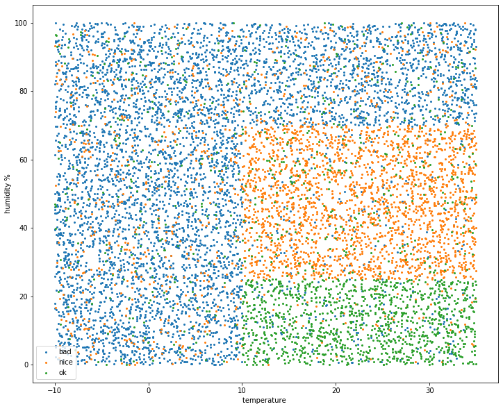
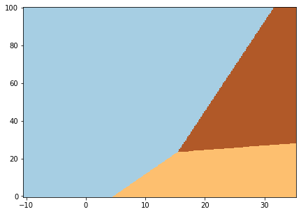
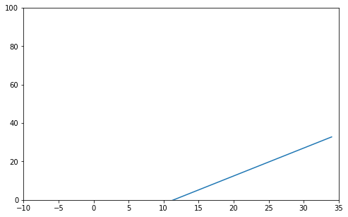
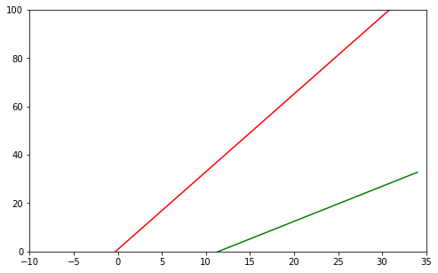

WORK IN PROGRESS
================

Just a messy notebook I used to generate some synthetic data and labels,
to build a simple ML model and get coefficients for decision boundaries,
used later in my Rust code on STM32F1 with BME280 environment sensor.

.. code:: ipython3

    import pandas as pd

.. code:: ipython3

    import random

.. code:: ipython3

    n = 10000

.. code:: ipython3

    # generate random values in range from -10 to 35 for temperature and 0 to 100 for humidity
    
    data = pd.DataFrame({'temp': [random.random() * 45 - 10 for _ in range(n)], 
                         'hum': [random.random() * 100 for _ in range(n)]})

.. code:: ipython3

    # check if generated values look OK
    
    data.describe()

.. raw:: html

    

    
    <table border="1" class="dataframe">
      <thead>
        <tr style="text-align: right;">
          <th></th>
          <th>temp</th>
          <th>hum</th>
        </tr>
      </thead>
      <tbody>
        <tr>
          <th>count</th>
          <td>10000.000000</td>
          <td>10000.000000</td>
        </tr>
        <tr>
          <th>mean</th>
          <td>12.492388</td>
          <td>49.817336</td>
        </tr>
        <tr>
          <th>std</th>
          <td>13.052862</td>
          <td>28.783640</td>
        </tr>
        <tr>
          <th>min</th>
          <td>-9.993413</td>
          <td>0.004202</td>
        </tr>
        <tr>
          <th>25%</th>
          <td>1.052624</td>
          <td>25.152596</td>
        </tr>
        <tr>
          <th>50%</th>
          <td>12.520486</td>
          <td>49.894043</td>
        </tr>
        <tr>
          <th>75%</th>
          <td>23.819750</td>
          <td>74.581331</td>
        </tr>
        <tr>
          <th>max</th>
          <td>34.994183</td>
          <td>99.999582</td>
        </tr>
      </tbody>
    </table>
    

.. code:: ipython3

    # humidity below 25% is considered 'dry', above 70%: 'humid', otherwise it's moderate
    
    data.loc[data['hum'] < 25, 'hum_cat'] = 'dry'
    data.loc[data['hum'] > 70, 'hum_cat'] = 'humid'
    data.loc[data['hum_cat'].isna(), 'hum_cat'] = 'moderate'

.. code:: ipython3

    data.head()

.. raw:: html

    

    
    <table border="1" class="dataframe">
      <thead>
        <tr style="text-align: right;">
          <th></th>
          <th>temp</th>
          <th>hum</th>
          <th>hum_cat</th>
        </tr>
      </thead>
      <tbody>
        <tr>
          <th>0</th>
          <td>-9.895657</td>
          <td>94.587835</td>
          <td>humid</td>
        </tr>
        <tr>
          <th>1</th>
          <td>19.882215</td>
          <td>65.536729</td>
          <td>moderate</td>
        </tr>
        <tr>
          <th>2</th>
          <td>10.956352</td>
          <td>90.759686</td>
          <td>humid</td>
        </tr>
        <tr>
          <th>3</th>
          <td>3.653477</td>
          <td>40.023353</td>
          <td>moderate</td>
        </tr>
        <tr>
          <th>4</th>
          <td>16.621728</td>
          <td>18.904795</td>
          <td>dry</td>
        </tr>
      </tbody>
    </table>
    

.. code:: ipython3

    # temperature below 10°C is considered 'cold', above 22°C: 'warm', otherwise it's moderate

.. code:: ipython3

    data.loc[data['temp'] < 10, 'temp_cat'] = 'cold'
    data.loc[data['temp'] > 22, 'temp_cat'] = 'warm'
    data.loc[data['temp_cat'].isna(), 'temp_cat'] = 'moderate'

.. code:: ipython3

    data.head()

.. raw:: html

    

    
    <table border="1" class="dataframe">
      <thead>
        <tr style="text-align: right;">
          <th></th>
          <th>temp</th>
          <th>hum</th>
          <th>hum_cat</th>
          <th>temp_cat</th>
        </tr>
      </thead>
      <tbody>
        <tr>
          <th>0</th>
          <td>-9.895657</td>
          <td>94.587835</td>
          <td>humid</td>
          <td>cold</td>
        </tr>
        <tr>
          <th>1</th>
          <td>19.882215</td>
          <td>65.536729</td>
          <td>moderate</td>
          <td>moderate</td>
        </tr>
        <tr>
          <th>2</th>
          <td>10.956352</td>
          <td>90.759686</td>
          <td>humid</td>
          <td>moderate</td>
        </tr>
        <tr>
          <th>3</th>
          <td>3.653477</td>
          <td>40.023353</td>
          <td>moderate</td>
          <td>cold</td>
        </tr>
        <tr>
          <th>4</th>
          <td>16.621728</td>
          <td>18.904795</td>
          <td>dry</td>
          <td>moderate</td>
        </tr>
      </tbody>
    </table>
    

.. code:: ipython3

    # combine the two columns
    data['weather'] = data['temp_cat'] + ' ' + data['hum_cat']

.. code:: ipython3

    data.head()

.. raw:: html

    

    
    <table border="1" class="dataframe">
      <thead>
        <tr style="text-align: right;">
          <th></th>
          <th>temp</th>
          <th>hum</th>
          <th>hum_cat</th>
          <th>temp_cat</th>
          <th>weather</th>
        </tr>
      </thead>
      <tbody>
        <tr>
          <th>0</th>
          <td>-9.895657</td>
          <td>94.587835</td>
          <td>humid</td>
          <td>cold</td>
          <td>cold humid</td>
        </tr>
        <tr>
          <th>1</th>
          <td>19.882215</td>
          <td>65.536729</td>
          <td>moderate</td>
          <td>moderate</td>
          <td>moderate moderate</td>
        </tr>
        <tr>
          <th>2</th>
          <td>10.956352</td>
          <td>90.759686</td>
          <td>humid</td>
          <td>moderate</td>
          <td>moderate humid</td>
        </tr>
        <tr>
          <th>3</th>
          <td>3.653477</td>
          <td>40.023353</td>
          <td>moderate</td>
          <td>cold</td>
          <td>cold moderate</td>
        </tr>
        <tr>
          <th>4</th>
          <td>16.621728</td>
          <td>18.904795</td>
          <td>dry</td>
          <td>moderate</td>
          <td>moderate dry</td>
        </tr>
      </tbody>
    </table>
    

.. code:: ipython3

    data['weather'].unique()

.. parsed-literal::

    array(['cold humid', 'moderate moderate', 'moderate humid',
           'cold moderate', 'moderate dry', 'warm humid', 'cold dry',
           'warm dry', 'warm moderate'], dtype=object)

.. code:: ipython3

    # weather is classified as one of three classes: 'nice', 'average', 'bad'

.. code:: ipython3

    weathercats = ['nice', 'ok', 'bad']

.. code:: ipython3

    # randomize
    
    random_cats = {}
    
    for idx, cat in enumerate(weathercats):
        output = [weathercats[idx] for _ in range(17)] + [weathercats[idx-1] for _ in range(2)] + [weathercats[idx-2]]
        random_cats[cat] = output
    
        

.. code:: ipython3

    random_cats

.. parsed-literal::

    {'nice': ['nice',
      'nice',
      'nice',
      'nice',
      'nice',
      'nice',
      'nice',
      'nice',
      'nice',
      'nice',
      'nice',
      'nice',
      'nice',
      'nice',
      'nice',
      'nice',
      'nice',
      'bad',
      'bad',
      'ok'],
     'ok': ['ok',
      'ok',
      'ok',
      'ok',
      'ok',
      'ok',
      'ok',
      'ok',
      'ok',
      'ok',
      'ok',
      'ok',
      'ok',
      'ok',
      'ok',
      'ok',
      'ok',
      'nice',
      'nice',
      'bad'],
     'bad': ['bad',
      'bad',
      'bad',
      'bad',
      'bad',
      'bad',
      'bad',
      'bad',
      'bad',
      'bad',
      'bad',
      'bad',
      'bad',
      'bad',
      'bad',
      'bad',
      'bad',
      'ok',
      'ok',
      'nice']}

.. code:: ipython3

    def randomizer(row, cat):
        return random.choice(random_cats[cat])

.. code:: ipython3

    data.head()

.. raw:: html

    

    
    <table border="1" class="dataframe">
      <thead>
        <tr style="text-align: right;">
          <th></th>
          <th>temp</th>
          <th>hum</th>
          <th>hum_cat</th>
          <th>temp_cat</th>
          <th>weather</th>
        </tr>
      </thead>
      <tbody>
        <tr>
          <th>0</th>
          <td>-9.895657</td>
          <td>94.587835</td>
          <td>humid</td>
          <td>cold</td>
          <td>cold humid</td>
        </tr>
        <tr>
          <th>1</th>
          <td>19.882215</td>
          <td>65.536729</td>
          <td>moderate</td>
          <td>moderate</td>
          <td>moderate moderate</td>
        </tr>
        <tr>
          <th>2</th>
          <td>10.956352</td>
          <td>90.759686</td>
          <td>humid</td>
          <td>moderate</td>
          <td>moderate humid</td>
        </tr>
        <tr>
          <th>3</th>
          <td>3.653477</td>
          <td>40.023353</td>
          <td>moderate</td>
          <td>cold</td>
          <td>cold moderate</td>
        </tr>
        <tr>
          <th>4</th>
          <td>16.621728</td>
          <td>18.904795</td>
          <td>dry</td>
          <td>moderate</td>
          <td>moderate dry</td>
        </tr>
      </tbody>
    </table>
    

.. code:: ipython3

    data['weather_cat'] = ''

.. code:: ipython3

    data.head()

.. raw:: html

    

    
    <table border="1" class="dataframe">
      <thead>
        <tr style="text-align: right;">
          <th></th>
          <th>temp</th>
          <th>hum</th>
          <th>hum_cat</th>
          <th>temp_cat</th>
          <th>weather</th>
          <th>weathercat</th>
          <th>weather_cat</th>
        </tr>
      </thead>
      <tbody>
        <tr>
          <th>0</th>
          <td>-9.895657</td>
          <td>94.587835</td>
          <td>humid</td>
          <td>cold</td>
          <td>cold humid</td>
          <td></td>
          <td></td>
        </tr>
        <tr>
          <th>1</th>
          <td>19.882215</td>
          <td>65.536729</td>
          <td>moderate</td>
          <td>moderate</td>
          <td>moderate moderate</td>
          <td></td>
          <td></td>
        </tr>
        <tr>
          <th>2</th>
          <td>10.956352</td>
          <td>90.759686</td>
          <td>humid</td>
          <td>moderate</td>
          <td>moderate humid</td>
          <td></td>
          <td></td>
        </tr>
        <tr>
          <th>3</th>
          <td>3.653477</td>
          <td>40.023353</td>
          <td>moderate</td>
          <td>cold</td>
          <td>cold moderate</td>
          <td></td>
          <td></td>
        </tr>
        <tr>
          <th>4</th>
          <td>16.621728</td>
          <td>18.904795</td>
          <td>dry</td>
          <td>moderate</td>
          <td>moderate dry</td>
          <td></td>
          <td></td>
        </tr>
      </tbody>
    </table>
    

.. code:: ipython3

    # weather is considered 'nice' if it's either warm and dry, or moderate temperature and dry 
    data.loc[data['weather'].isin(['warm dry', 'moderate dry']), 'weather_cat'] \
    = data.loc[data['weather'].isin(['warm dry', 'moderate dry']), 'weather_cat'].apply(lambda row: randomizer(row,'nice'))

.. code:: ipython3

    # weather is considered 'bad' when it's cold and/od humid
    data.loc[data['weather'].isin(['cold humid', 'moderate humid', 'cold moderate', 'warm humid', 'cold dry']), 'weather_cat'] \
    = data.loc[data['weather'].isin(['cold humid', 'moderate humid', 'cold moderate', 'warm humid', 'cold dry']), 'weather_cat'] \
    .apply(lambda row: randomizer(row, 'bad'))

.. code:: ipython3

    # if it's some other combination, then the weather is considered 'ok'
    data.loc[data['weather'].isin(['warm moderate','moderate moderate']), 'weather_cat'] \
    = data.loc[data['weather'].isin(['warm moderate','moderate moderate']), 'weather_cat'] \
    .apply(lambda row: randomizer(row, 'ok'))

.. code:: ipython3

    data.head()

.. raw:: html

    

    
    <table border="1" class="dataframe">
      <thead>
        <tr style="text-align: right;">
          <th></th>
          <th>temp</th>
          <th>hum</th>
          <th>hum_cat</th>
          <th>temp_cat</th>
          <th>weather</th>
          <th>weathercat</th>
          <th>weather_cat</th>
        </tr>
      </thead>
      <tbody>
        <tr>
          <th>0</th>
          <td>-9.895657</td>
          <td>94.587835</td>
          <td>humid</td>
          <td>cold</td>
          <td>cold humid</td>
          <td></td>
          <td>bad</td>
        </tr>
        <tr>
          <th>1</th>
          <td>19.882215</td>
          <td>65.536729</td>
          <td>moderate</td>
          <td>moderate</td>
          <td>moderate moderate</td>
          <td></td>
          <td>ok</td>
        </tr>
        <tr>
          <th>2</th>
          <td>10.956352</td>
          <td>90.759686</td>
          <td>humid</td>
          <td>moderate</td>
          <td>moderate humid</td>
          <td></td>
          <td>bad</td>
        </tr>
        <tr>
          <th>3</th>
          <td>3.653477</td>
          <td>40.023353</td>
          <td>moderate</td>
          <td>cold</td>
          <td>cold moderate</td>
          <td></td>
          <td>bad</td>
        </tr>
        <tr>
          <th>4</th>
          <td>16.621728</td>
          <td>18.904795</td>
          <td>dry</td>
          <td>moderate</td>
          <td>moderate dry</td>
          <td></td>
          <td>nice</td>
        </tr>
      </tbody>
    </table>
    

.. code:: ipython3

    import matplotlib.pyplot as plt

.. code:: ipython3

    # plot all the data points
    
    fig, ax = plt.subplots(figsize = (12,10))
    for cat in data['weather_cat'].unique():
        plt.scatter(x = data.loc[data['weather_cat'] == cat, 'temp'], y = data.loc[data['weather_cat'] == cat, 'hum'], s = 4)
    ax.set_ylabel('humidity %')
    ax.set_xlabel('temperature ')
    ax.legend(['bad', 'nice', 'ok'])

.. parsed-literal::

    <matplotlib.legend.Legend at 0x7fde692170d0>

.. code:: ipython3

    data['weather_cat'] = pd.Categorical(data['weather_cat'])

.. code:: ipython3

    data['weather_cat_idx'] = data['weather_cat'].cat.codes

.. code:: ipython3

    # bad is 0, nice is 1, ok is 2
    
    data.head()

.. raw:: html

    

    
    <table border="1" class="dataframe">
      <thead>
        <tr style="text-align: right;">
          <th></th>
          <th>temp</th>
          <th>hum</th>
          <th>hum_cat</th>
          <th>temp_cat</th>
          <th>weather</th>
          <th>weathercat</th>
          <th>weather_cat</th>
          <th>weather_cat_idx</th>
        </tr>
      </thead>
      <tbody>
        <tr>
          <th>0</th>
          <td>-9.895657</td>
          <td>94.587835</td>
          <td>humid</td>
          <td>cold</td>
          <td>cold humid</td>
          <td></td>
          <td>bad</td>
          <td>0</td>
        </tr>
        <tr>
          <th>1</th>
          <td>19.882215</td>
          <td>65.536729</td>
          <td>moderate</td>
          <td>moderate</td>
          <td>moderate moderate</td>
          <td></td>
          <td>ok</td>
          <td>2</td>
        </tr>
        <tr>
          <th>2</th>
          <td>10.956352</td>
          <td>90.759686</td>
          <td>humid</td>
          <td>moderate</td>
          <td>moderate humid</td>
          <td></td>
          <td>bad</td>
          <td>0</td>
        </tr>
        <tr>
          <th>3</th>
          <td>3.653477</td>
          <td>40.023353</td>
          <td>moderate</td>
          <td>cold</td>
          <td>cold moderate</td>
          <td></td>
          <td>bad</td>
          <td>0</td>
        </tr>
        <tr>
          <th>4</th>
          <td>16.621728</td>
          <td>18.904795</td>
          <td>dry</td>
          <td>moderate</td>
          <td>moderate dry</td>
          <td></td>
          <td>nice</td>
          <td>1</td>
        </tr>
      </tbody>
    </table>
    

.. code:: ipython3

    from sklearn.linear_model import LogisticRegression

.. code:: ipython3

    X = data[['temp', 'hum']]

.. code:: ipython3

    y = data['weather_cat_idx']

.. code:: ipython3

    logreg = LogisticRegression(C = 1e5)

.. code:: ipython3

    logreg.fit(X,y)

.. parsed-literal::

    /home/nebelgrau/miniconda3/envs/minimal_ds/lib/python3.7/site-packages/sklearn/linear_model/logistic.py:432: FutureWarning: Default solver will be changed to 'lbfgs' in 0.22. Specify a solver to silence this warning.
      FutureWarning)
    /home/nebelgrau/miniconda3/envs/minimal_ds/lib/python3.7/site-packages/sklearn/linear_model/logistic.py:469: FutureWarning: Default multi_class will be changed to 'auto' in 0.22. Specify the multi_class option to silence this warning.
      "this warning.", FutureWarning)

.. parsed-literal::

    LogisticRegression(C=100000.0, class_weight=None, dual=False,
                       fit_intercept=True, intercept_scaling=1, l1_ratio=None,
                       max_iter=100, multi_class='warn', n_jobs=None, penalty='l2',
                       random_state=None, solver='warn', tol=0.0001, verbose=0,
                       warm_start=False)

.. code:: ipython3

    logreg.coef_

.. parsed-literal::

    array([[-0.09970853,  0.0309918 ],
           [ 0.06826359, -0.04702842],
           [ 0.05767628, -0.00212381]])

.. code:: ipython3

    logreg.intercept_

.. parsed-literal::

    array([-0.02518554, -0.77952247, -1.6711203 ])

.. code:: ipython3

    x_min, x_max = X.iloc[:,0].min() - .5, X.iloc[:,0].max() + .5, 

.. code:: ipython3

    y_min, y_max = X.iloc[:,1].min() - .5, X.iloc[:,1].max() + .5, 

.. code:: ipython3

    h = .2 # step in the mesh

.. code:: ipython3

    import numpy as np

.. code:: ipython3

    xx, yy = np.meshgrid(np.arange(x_min, x_max, h), np.arange(y_min, y_max, h))

.. code:: ipython3

    Z = logreg.predict(np.c_[xx.ravel(), yy.ravel()])

.. code:: ipython3

    Z = Z.reshape(xx.shape)

.. code:: ipython3

    plt.figure(1, figsize = (7,5))
    plt.pcolormesh(xx, yy, Z, cmap = plt.cm.Paired)

.. parsed-literal::

    <matplotlib.collections.QuadMesh at 0x7fde54c26350>

.. code:: ipython3

    data.info()

.. parsed-literal::

    <class 'pandas.core.frame.DataFrame'>
    RangeIndex: 10000 entries, 0 to 9999
    Data columns (total 8 columns):
     #   Column           Non-Null Count  Dtype   
    ---  ------           --------------  -----   
     0   temp             10000 non-null  float64 
     1   hum              10000 non-null  float64 
     2   hum_cat          10000 non-null  object  
     3   temp_cat         10000 non-null  object  
     4   weather          10000 non-null  object  
     5   weathercat       10000 non-null  object  
     6   weather_cat      10000 non-null  category
     7   weather_cat_idx  10000 non-null  int8    
    dtypes: category(1), float64(2), int8(1), object(4)
    memory usage: 488.5+ KB

.. code:: ipython3

    data['weather_cat'].unique()

.. parsed-literal::

    [bad, ok, nice]
    Categories (3, object): [bad, ok, nice]

.. code:: ipython3

    # get the two boundaries for 'nice' and for 'bad'

.. code:: ipython3

    data.loc[data['weather_cat'] == 'nice', 'nice'] = 1

.. code:: ipython3

    data.loc[data['nice'].isna(), 'nice'] = 0 

.. code:: ipython3

    data.loc[data['weather_cat'] == 'bad', 'bad'] = 1

.. code:: ipython3

    data.loc[data['bad'].isna(), 'bad'] = 0 

.. code:: ipython3

    data.head()

.. raw:: html

    

    
    <table border="1" class="dataframe">
      <thead>
        <tr style="text-align: right;">
          <th></th>
          <th>temp</th>
          <th>hum</th>
          <th>hum_cat</th>
          <th>temp_cat</th>
          <th>weather</th>
          <th>weathercat</th>
          <th>weather_cat</th>
          <th>weather_cat_idx</th>
          <th>nice</th>
          <th>bad</th>
        </tr>
      </thead>
      <tbody>
        <tr>
          <th>0</th>
          <td>-9.895657</td>
          <td>94.587835</td>
          <td>humid</td>
          <td>cold</td>
          <td>cold humid</td>
          <td></td>
          <td>bad</td>
          <td>0</td>
          <td>0.0</td>
          <td>1.0</td>
        </tr>
        <tr>
          <th>1</th>
          <td>19.882215</td>
          <td>65.536729</td>
          <td>moderate</td>
          <td>moderate</td>
          <td>moderate moderate</td>
          <td></td>
          <td>ok</td>
          <td>2</td>
          <td>0.0</td>
          <td>0.0</td>
        </tr>
        <tr>
          <th>2</th>
          <td>10.956352</td>
          <td>90.759686</td>
          <td>humid</td>
          <td>moderate</td>
          <td>moderate humid</td>
          <td></td>
          <td>bad</td>
          <td>0</td>
          <td>0.0</td>
          <td>1.0</td>
        </tr>
        <tr>
          <th>3</th>
          <td>3.653477</td>
          <td>40.023353</td>
          <td>moderate</td>
          <td>cold</td>
          <td>cold moderate</td>
          <td></td>
          <td>bad</td>
          <td>0</td>
          <td>0.0</td>
          <td>1.0</td>
        </tr>
        <tr>
          <th>4</th>
          <td>16.621728</td>
          <td>18.904795</td>
          <td>dry</td>
          <td>moderate</td>
          <td>moderate dry</td>
          <td></td>
          <td>nice</td>
          <td>1</td>
          <td>1.0</td>
          <td>0.0</td>
        </tr>
      </tbody>
    </table>
    

.. code:: ipython3

    # logistic regression for 'nice' vs. everything else

.. code:: ipython3

    X = data[['temp', 'hum']] 

.. code:: ipython3

    y = data['nice']

.. code:: ipython3

    logreg.fit(X,y)

.. parsed-literal::

    /home/nebelgrau/miniconda3/envs/minimal_ds/lib/python3.7/site-packages/sklearn/linear_model/logistic.py:432: FutureWarning: Default solver will be changed to 'lbfgs' in 0.22. Specify a solver to silence this warning.
      FutureWarning)

.. parsed-literal::

    LogisticRegression(C=100000.0, class_weight=None, dual=False,
                       fit_intercept=True, intercept_scaling=1, l1_ratio=None,
                       max_iter=100, multi_class='warn', n_jobs=None, penalty='l2',
                       random_state=None, solver='warn', tol=0.0001, verbose=0,
                       warm_start=False)

.. code:: ipython3

    W_nice, b_nice = logreg.coef_, logreg.intercept_

.. code:: ipython3

    W_nice

.. parsed-literal::

    array([[ 0.06826359, -0.04702842]])

.. code:: ipython3

    b_nice

.. parsed-literal::

    array([-0.77952247])

.. code:: ipython3

    x = np.arange(-10,35)

.. code:: ipython3

    y = -(x * W_nice[0][0] + b_nice[0]) / W_nice[0][1]

.. code:: ipython3

    fig, ax = plt.subplots(figsize = (8,5))
    ax.set_xlim(-10,35)
    ax.set_ylim(0,100)
    plt.plot(x, y)

.. parsed-literal::

    [<matplotlib.lines.Line2D at 0x7fde54be6d90>]

.. code:: ipython3

    X = data[['temp', 'hum']] 

.. code:: ipython3

    y = data['bad']

.. code:: ipython3

    logreg.fit(X,y)

.. parsed-literal::

    /home/nebelgrau/miniconda3/envs/minimal_ds/lib/python3.7/site-packages/sklearn/linear_model/logistic.py:432: FutureWarning: Default solver will be changed to 'lbfgs' in 0.22. Specify a solver to silence this warning.
      FutureWarning)

.. parsed-literal::

    LogisticRegression(C=100000.0, class_weight=None, dual=False,
                       fit_intercept=True, intercept_scaling=1, l1_ratio=None,
                       max_iter=100, multi_class='warn', n_jobs=None, penalty='l2',
                       random_state=None, solver='warn', tol=0.0001, verbose=0,
                       warm_start=False)

.. code:: ipython3

    W_bad, b_bad = logreg.coef_, logreg.intercept_

.. code:: ipython3

    W_bad

.. parsed-literal::

    array([[-0.09970853,  0.0309918 ]])

.. code:: ipython3

    b_bad

.. parsed-literal::

    array([-0.02518554])

.. code:: ipython3

    t = np.arange(-10,35)

.. code:: ipython3

    h_nice = -(t * W_nice[0][0] + b_nice[0]) / W_nice[0][1]

.. code:: ipython3

    h_bad = -(t * W_bad[0][0] + b_bad[0]) / W_bad[0][1]

.. code:: ipython3

    fig, ax = plt.subplots(figsize = (8,5))
    ax.set_xlim(-10,35)
    ax.set_ylim(0,100)
    plt.plot(t, h_nice, c = 'g')
    plt.plot(t, h_bad, c = 'r')

.. parsed-literal::

    [<matplotlib.lines.Line2D at 0x7fde547952d0>]

.. code:: ipython3

    samples = [(25,70), (10,15), (24,23), (21,60), (7,60), (23,15), (28,80)]

.. code:: ipython3

    for sample in samples:
        t, h = sample
        
        h_nice = -(t * W_nice[0][0] + b_nice[0]) / W_nice[0][1]
        h_bad = -(t * W_bad[0][0] + b_bad[0]) / W_bad[0][1]
        
        print("temp {}°C, hum {}% - hum_nice {}%, hum_bad {}%".format(t,h,h_nice, h_bad))
        
        if h >= h_bad:
            print("temp: {}°C, hum: {}% - bad! :(".format(t,h))
        elif h <= h_nice:
            print("temp: {}°C, hum: {}% - nice! :) ".format(t,h))
        else:
            print("temp: {}°C, hum: {}% - it's ok.".format(t,h))
        

.. parsed-literal::

    temp 25°C, hum 70% - hum_nice 19.71291557867815%, hum_bad 81.24403029375354%
    temp: 25°C, hum: 70% - it's ok.
    temp 10°C, hum 15% - hum_nice -2.060170511303494%, hum_bad 32.985203098168974%
    temp: 10°C, hum: 15% - it's ok.
    temp 24°C, hum 23% - hum_nice 18.261376506012706%, hum_bad 78.02677514738124%
    temp: 24°C, hum: 23% - it's ok.
    temp 21°C, hum 60% - hum_nice 13.906759288016376%, hum_bad 68.37500970826433%
    temp: 21°C, hum: 60% - it's ok.
    temp 7°C, hum 60% - hum_nice -6.414787729299824%, hum_bad 23.333437659052063%
    temp: 7°C, hum: 60% - bad! :(
    temp 23°C, hum 15% - hum_nice 16.809837433347266%, hum_bad 74.80952000100895%
    temp: 23°C, hum: 15% - nice! :) 
    temp 28°C, hum 80% - hum_nice 24.06753279667448%, hum_bad 90.89579573287047%
    temp: 28°C, hum: 80% - it's ok.

.. code:: ipython3

    from sklearn.preprocessing import PolynomialFeatures

.. code:: ipython3

    from sklearn.pipeline import Pipeline

.. code:: ipython3

    from sklearn.model_selection import train_test_split

.. code:: ipython3

    X = data[['hum', 'temp']]

.. code:: ipython3

    y = data['weather_cat_idx']

.. code:: ipython3

    poly = PolynomialFeatures(degree = 2, interaction_only = False, include_bias = False)

.. code:: ipython3

    X_train, X_test, y_train, y_test = train_test_split(X,y)

.. code:: ipython3

    X_train.shape

.. parsed-literal::

    (7500, 2)

.. code:: ipython3

    X_poly = poly.fit_transform(X_train)

.. code:: ipython3

    X_poly.shape

.. parsed-literal::

    (7500, 5)

.. code:: ipython3

    lr = LogisticRegression()

.. code:: ipython3

    lr.fit(X_poly, y_train)

.. parsed-literal::

    /home/nebelgrau/miniconda3/envs/minimal_ds/lib/python3.7/site-packages/sklearn/linear_model/logistic.py:432: FutureWarning: Default solver will be changed to 'lbfgs' in 0.22. Specify a solver to silence this warning.
      FutureWarning)
    /home/nebelgrau/miniconda3/envs/minimal_ds/lib/python3.7/site-packages/sklearn/linear_model/logistic.py:469: FutureWarning: Default multi_class will be changed to 'auto' in 0.22. Specify the multi_class option to silence this warning.
      "this warning.", FutureWarning)

.. parsed-literal::

    LogisticRegression(C=1.0, class_weight=None, dual=False, fit_intercept=True,
                       intercept_scaling=1, l1_ratio=None, max_iter=100,
                       multi_class='warn', n_jobs=None, penalty='l2',
                       random_state=None, solver='warn', tol=0.0001, verbose=0,
                       warm_start=False)

.. code:: ipython3

    lr.score(poly.transform(X_test), y_test)

.. parsed-literal::

    0.812

.. code:: ipython3

    lr.coef_

.. parsed-literal::

    array([[-0.05867425, -0.22381246,  0.00064098,  0.00203191,  0.00057312],
           [-0.11351455,  0.17867957,  0.00097417, -0.00152636, -0.00197617],
           [ 0.16371461,  0.09708219, -0.00176706,  0.00037869, -0.00162209]])

.. code:: ipython3

    lr.intercept_

.. parsed-literal::

    array([ 2.31396237, -0.29475986, -4.66592429])

.. code:: ipython3

    '''
    Once the model is fit we call .coef_ and .intercept_ to see the predicted coefficients and intercept term. 
    Following the linear form Y = Mx + b we can now see the linear equation for our decision boundary is 
    Sepal_Length * (0.4437) + Petal_Width * (-4.6018) + 0.9626. 
    
    so that's SL * W[0] + PW * W[1] + b
    
    SL is X, PW is Y
    
    so PW * W[1] = -SL * W[0] - b
    therefore PW = -(SL*W[0] + b) / W[1]
    '''
    

.. code:: ipython3

    X = data[['hum', 'temp']]

.. code:: ipython3

    y = data['nice']

.. code:: ipython3

    poly = PolynomialFeatures(degree = 2, interaction_only = False, include_bias = False)

.. code:: ipython3

    X_train, X_test, y_train, y_test = train_test_split(X,y)

.. code:: ipython3

    X_train.shape

.. parsed-literal::

    (7500, 2)

.. code:: ipython3

    X_poly = poly.fit_transform(X_train)

.. code:: ipython3

    X_poly.shape

.. parsed-literal::

    (7500, 5)

.. code:: ipython3

    lr = LogisticRegression()

.. code:: ipython3

    lr.fit(X_poly, y_train)

.. parsed-literal::

    /home/nebelgrau/miniconda3/envs/minimal_ds/lib/python3.7/site-packages/sklearn/linear_model/logistic.py:432: FutureWarning: Default solver will be changed to 'lbfgs' in 0.22. Specify a solver to silence this warning.
      FutureWarning)

.. parsed-literal::

    LogisticRegression(C=1.0, class_weight=None, dual=False, fit_intercept=True,
                       intercept_scaling=1, l1_ratio=None, max_iter=100,
                       multi_class='warn', n_jobs=None, penalty='l2',
                       random_state=None, solver='warn', tol=0.0001, verbose=0,
                       warm_start=False)

.. code:: ipython3

    lr.score(poly.transform(X_test), y_test)

.. parsed-literal::

    0.8984

.. code:: ipython3

    W = lr.coef_

.. code:: ipython3

    W

.. parsed-literal::

    array([[-0.08605272,  0.19827515,  0.00075882, -0.00193614, -0.00202101]])

.. code:: ipython3

    b = lr.intercept_

.. code:: ipython3

    b

.. parsed-literal::

    array([-0.95894752])

.. code:: ipython3

    '''
    f(x,y; c) = c_0 + c_1 x + c_2 y + c_3 x² + c_4 x y + c_5 y²
    
    
    linear: 
    
    f(x,y;c) = c_0 + c_1 x + c_2 y
    Y = Mx + b -> Y*c2 = - x*c1  - c0 -> Y = -(x*c1 + c0) / c2
    
    
    
    c4xy + c5y2 +c2y = - c0 - c1x - c3x2
    
    (c4x + c5y + c2)y = -c0 - c1x - c3x2
    
    
    '''
    

.. code:: ipython3

    def result(x,y):
        return b[0] + W[0][0]*x + W[0][1]*y + W[0][2]*x*x + W[0][3]*x*y + W[0][4]*y*y

.. code:: ipython3

    samples = [(25,70), (10,15), (24,23), (21,60), (7,60), (23,15), (28,80)]

.. code:: ipython3

    for sample in samples:
        print(sample[0], sample[1], result(sample[0], sample[1]))

.. parsed-literal::

    25 70 -2.0479145113402613
    10 15 0.4853876847428495
    24 23 -0.16466236681893487
    21 60 -0.250062424707326
    7 60 2.2835722283676736
    23 15 -0.6853089916736277
    28 80 -4.1828858438687675

